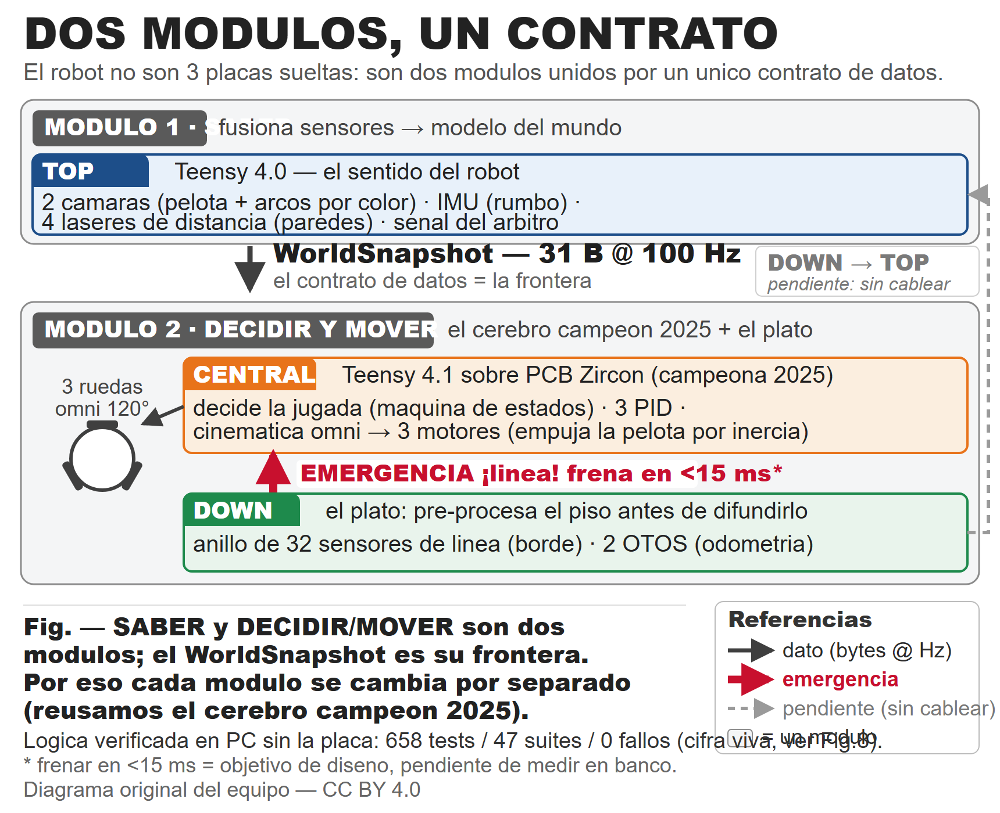

> ⚠️ **VERSIÓN DE TRABAJO EN ESPAÑOL** — el Poster y el TDP **FINALES deben entregarse en INGLÉS** (requisito de rúbrica RoboCupJunior Soccer 2026). Este documento es la versión de trabajo en español que el equipo lee y mejora. **Traducir al inglés antes de enviar el formulario online del TDP.**

---

# Technical Documentation Paper (TDP) — RoboCupJunior Soccer Open League 2026

**Equipo:** IITA Low Battery Messi
**Organización:** IITA (Instituto de Innovación y Tecnología Aplicada) · Fundación Innovar — Salta, Argentina
**Liga / sub-liga:** RoboCupJunior Soccer — **Open League**
**Evento:** RoboCup 2026 — Incheon, Corea del Sur (30 jun – 6 jul 2026)
**Clasificación:** Campeones nacionales de la **primera edición** de RoboCupJunior Soccer Argentina (Roboliga, UAI, diciembre 2025)
**Repositorio (open-source, MIT):** https://github.com/IITA-Proyectos/open-soccer-robocup-team2026

| Rol | Nombre | Detalle |
|---|---|---|
| Competidora — Soccer Open (viaja) | María Virginia Viollaz (@mariaviollaz), 18 | Estrategia arquero, trayectorias, banco, diseño, documentación. **Aprendió a diseñar con IA** (VIBE). Campeona nacional 2022 (Rescue Line) + mundial RoboCup 2023, Eindhoven |
| Competidor — Soccer Open (viaja) | Elías Cordero, 18 (Ing. Electromecánica, UNSa) | Visión artificial, estrategia delantero, cinemática, mediciones y calibración. **Aprendió a diseñar con IA** (VIBE) |
| Coach principal (viaja) | Enzo Juárez Velázquez (@enzzo195) | Guía del diseño de PCB con IA (VIBE PCB design, EasyEDA vía MCP), validación eléctrica, bodges de hardware, revisión técnica. En Incheon **además dirige al equipo IITA de RCJ Rescue Line** |
| Coach secundaria (viaja) | Cecilia Budeguer | Acompañamiento del equipo en Incheon (respaldo, sobre todo mientras Enzo asiste al equipo de Rescue Line) |
| Director del proyecto (NO viaja) | Gustavo Viollaz (@gviollaz) | Coordinación, integración de las 3 placas, sesiones de banco. Obligaciones laborales le impiden viajar a Corea |

> **Cómo leer este TDP (para el juez):** las 4 secciones mapean 1:1 a los 4 criterios de la rúbrica del TDP — **§1 Electrical**, **§2 Mechanical**, **§3 Software**, **§4 Presentation / Narrativa**. Cada decisión de diseño se presenta con el formato **Decisión → Por qué → Dato**. El cierre (§5) reclama explícitamente los **2 puntos bonus** (open-source CAD/PCB y open-source software). Lo que todavía **no** está validado en hardware se marca como tal honestamente, distinguiendo *"verificado en banco"* de *"verificado sólo en host"*.
>
> **🔑 Tres niveles de madurez — los usamos en TODO el documento (honestidad de ingeniería):**
> - **VALIDADO EN BANCO** — probado en la placa real por el equipo humano (única forma de cerrar una cosa de hardware: Claude planifica/programa, el equipo valida).
> - **VERIFICADO EN HOST** — pasa los tests host-native en g++ (golden byte-idéntico, `pio` compila SUCCESS), pero **todavía no se corrió en el robot**. Es *código terminado*, no *comportamiento probado*.
> - **OBJETIVO DE DISEÑO** — número que buscamos pero que **no medimos** (p. ej. cargas de CPU, los 100 Hz nominales). Si decimos "100 Hz de diseño" y al lado "(banco: 66 Hz)", el primero es objetivo y el segundo es lo medido.
>
> Una porción importante de lo nuevo de este robot está hoy en **VERIFICADO EN HOST** esperando banco: lo declaramos arriba en vez de esconderlo (el detalle por feature en §3.9, y el estado realista para Incheon en §4.4).

---

## Lo que más nos enorgullece (la feature protagonista)

**Aprendimos a diseñar nuestro propio hardware usando IA — y lo validamos nosotros.** Salimos campeones nacionales con dos robots que, siendo honestos, tenían una estructura y una tecnología pobres. Para el mundial decidimos rehacerlos, pero teníamos un problema: somos estudiantes y **no sabíamos diseñar placas electrónicas** ni dominábamos las tecnologías que queríamos usar. La historia de este robot es **cómo, usando la IA como herramienta de aprendizaje y diseño, aprendimos a diseñar nuestras propias placas** — las DOS placas nuevas (TOP = percepción / DOWN = piso y línea) se diseñaron **casi todas con "VIBE PCB design": un agente de IA (Claude Code) conectado por MCP a EasyEDA** generaba y comandaba el diseño del PCB, y el equipo aprendía, decidía y validaba cada cambio. También **probamos Flux comandado por IA, pero NO funcionó** — lo contamos porque el ensayo-y-error honesto es parte del aprendizaje. No fue "ya sabíamos": fue un **genuino proceso de aprender CÓMO se diseñan PCBs con IA**. En lo mecánico empezamos a rediseñar en 3D el soporte de motores (Fusion asistido por IA, "VIBE 3D", recién arrancando). Y **mantuvimos el cerebro campeón 2025** (CENTRAL = la PCB Zircon que ganó el Nacional) y construimos alrededor.

**Encuadre de autoría (firme):** la IA fue la **herramienta**; el **equipo** aprendió, decidió y validó. Somos los responsables de cada cosa que subió al robot. El diseño fue asistido por IA y guiado por el coach principal (Enzo), con los competidores (María, Elías) aprendiendo, decidiendo y validando.

**La garantía de que el aprendizaje fue serio (no copiar-pegar de la IA):** probábamos cada cosa en la computadora antes de confiar en ella. La lógica vive en **módulos C++ puros testeados host-native** — **cientos de pruebas automáticas (858 hoy), 0 fallos, en segundos** (medido 2026-06-14 con `scripts/run-host-tests.sh`). Eso, más abajo, es la **evidencia** de todo lo que diseñamos con IA y de cómo lo validamos. La arquitectura de 3 placas, el "sin kicker" y todo el detalle técnico que sigue **son el cuerpo de evidencia** de esta historia, no un tema aparte.

## Resumen del robot (contexto en 30 segundos)

Dos robots omnidireccionales (base KIWI de 3 ruedas omni a 120°): **ROBOT1 = arquero**, **ROBOT2 = delantero**. Sin kicker físico: el delantero empuja la pelota por inercia. La inteligencia se distribuye en **3 placas Teensy + 1 placa COMM + 2 cámaras**:

| Placa | MCU | Rol | Sensores principales |
|---|---|---|---|
| **TOP** | Teensy 4.0 | Cerebro sensorial | 2 cámaras OpenMV N6 + 2 BNO055 (IMU) + 4 ToF VL53L7CX + 1 HC-SR04 + árbitro por GPIO |
| **CENTRAL** | Teensy 4.1 (sobre PCB Zircon Rev v15) | Cerebro decisor / master | FSM táctica + 3 PID + cinemática inversa omni-3 + 3 motores |
| **DOWN** | Teensy 4.0 | Sensor de piso | Anillo de 32 sensores de línea (4 mux CD4051) + 2 OTOS de odometría óptica |
| **COMM** | ESP32-C6 | Árbitro RCJ + partner | Fork del módulo oficial RCJ; entrega START/STOP por nivel GPIO |

TOP fusiona todo en un **WorldSnapshot de 31 bytes** que envía a CENTRAL por UART a **100 Hz de diseño (banco 2026-06-14: 66 Hz medidos, enlace limpio crc=0/seqGap=0)**; DOWN difunde línea + odometría a CENTRAL y TOP (broadcast simétrico). La lógica de decisión vive en **módulos C++ puros** verificados con una suite **host-native (858 tests / 61 suites / 0 fallos, medido 2026-06-14 con `scripts/run-host-tests.sh`)** que corre en una PC sin la placa.

**Lectura en 2 módulos (la idea de diseño que organiza todo).** Aunque físicamente son 3 placas + COMM, conceptualmente el robot se diseñó como **DOS módulos** con responsabilidades claras y una interfaz de datos limpia entre ellos:

- **MÓDULO SUPERIOR — percepción / comunicación.** Su trabajo es **SABER el estado del juego**: dónde están todos los elementos en la cancha (pelota, arcos, obstáculos), a qué **velocidad** se mueven y —a futuro— **comunicarse con el robot compañero** para compartir y complementar información. Es la **capa de fusión de sensores** (visión + IMU + ToF + ultrasonido → un modelo del mundo, el **WorldSnapshot**). Lo encarna la placa **TOP**.
- **MÓDULO INFERIOR — drivetrain + cerebro de decisión.** Es la parte **MÓVIL** (motores y drivers) más el **cerebro que DECIDE la jugada** (la placa **CENTRAL** campeona, Zircon). Incluye una **placa auxiliar de piso (DOWN)** con sensores (luz/línea, odometría OTOS y, a futuro, encoders de motor) cuya información **no viaja cruda**: llega al módulo superior **pre-procesada y mejorada** (broadcast simétrico).
- **La interfaz entre módulos es un contrato de datos byte-a-byte** (el WorldSnapshot de 31 B). Esto es lo que vuelve modular al diseño: cada módulo se **diseña, mejora y testea por separado**, y un módulo puede reemplazarse sin rehacer el otro. Esa independencia **acelera tiempos** —trabajo en paralelo y reemplazo aislado de un módulo— y conecta directamente con la meta de comprimir el ciclo concepto→robot que detallamos en §4.5.
- **Puerta abierta en el módulo inferior:** el diseño deja **lugar para un KICKER y un DRIBBLER**. Hoy no se montaron porque exigían cambiar los motores por unos más **cortos** que liberaran espacio interno, y no había tiempo → se priorizó lo realizable en poco plazo (el delantero **empuja por inercia**). Al estar la decisión/movilidad encapsulada en el módulo inferior, sumarlos más adelante **no obliga a rediseñar el módulo superior**.



---

# §1. ELECTRICAL — Diseño eléctrico replicable, con razonamiento basado en datos

> **Objetivo de rúbrica (Excellent):** dar detalle suficiente para que un lector técnico **replique el proceso de diseño**, evaluar el uso de recursos y dar **razonamiento basado en datos** para cada decisión. Esta sección está organizada como *Decisión → Por qué → Dato*, con tablas de pinout reproducibles y los procedimientos de bring-up que evitan los errores que nosotros ya cometimos.

> **Estas dos placas (TOP y DOWN) son el resultado concreto del flujo VIBE PCB design con IA** descripto en "Lo que más nos enorgullece" y detallado en §4.5: el esquemático y el ruteo se generaron casi todos con un agente de IA (Claude Code) conectado por MCP a EasyEDA, y el equipo validó cada decisión eléctrica. Todo el detalle que sigue —pinouts, buses, cadena de potencia, iteraciones de bring-up— es la **evidencia de qué diseñamos con IA y cómo lo verificamos nosotros**. (CENTRAL es la PCB Zircon campeona 2025, reusada.)

## 1.1 Topología eléctrica general

El robot usa **4 microcontroladores** (3 Teensy + 1 ESP32-C6) sobre **3 PCB custom + 1 placa comercial**:

| Placa | PCB | MCU | Núcleo |
|---|---|---|---|
| TOP | "Roboliga2026_TOP" (custom, 2 capas, ≈224.0 × 97.5 mm) | Teensy 4.0 (U14) | Cortex-M7 @ 600 MHz |
| CENTRAL | Zircon Rev v15 (comercial, Robomov) | Teensy 4.1 | Cortex-M7 @ 600 MHz |
| DOWN | "Roboliga 2026 Futbol" REV 1.0 (custom, ≈175.1 × 165.7 mm) | Teensy 4.0 (U7) | Cortex-M7 @ 600 MHz |
| COMM | "PCB1" (custom, 25.40 × 31.20 mm) | ESP32-C6-MINI-1-N4 | RISC-V, WiFi6/BLE5/802.15.4 |

**Decisión:** distribuir la electrónica en placas especialistas en lugar de una sola placa monolítica.
**Por qué:** *procesar donde está el sensor, decidir en el centro* (regla estándar de robótica móvil, refs. CAMBADA MSL y PCBWay RCJ 2022/2024). Reduce el tráfico UART y deja cada periférico sin pelear por el bus de otra placa.
**Dato:** cada MCU corre por diseño a **< 30 % de CPU** (TOP ~25 %, CENTRAL ~20 %, DOWN ~22 % — estimaciones de diseño documentadas en `docs/ARQUITECTURA-3-PLACAS-2026.md`). *(Caveat: son objetivos de diseño, no medidos con osciloscopio/profiler; ver gap "métricas en vivo".)*

## 1.2 Alimentación (cadena replicable)

**Cadena de potencia idéntica en TOP y DOWN** (CENTRAL usa la regulación del Zircon):

```
LiPo 2S 7.4 V nominal ──► Conector Deans-T-F (XP1)
                          │
            2× Diodo Schottky B5819W (1A/40V, LCSC C8598)  ← protección de polaridad / OR-ing
                          │
            ┌─────────────┴─────────────┐
   Buck MP1584-EN (≈5 V lógica)   Buck MP1584-EN (≈3.3 V sensores)
```

**Decisión:** dos reguladores buck MP1584-EN independientes por placa (un rail ≈5 V lógica, otro ≈3.3 V sensores) + 2 diodos Schottky de protección.
**Por qué:** separar el rail de sensores del de lógica reduce ruido conducido; el Teensy 4.0 **no tolera 5 V en GPIO** (máx 3.3 V), así que la electrónica de 5 V (p. ej. HC-SR04) debe adaptarse.
**Dato crítico aprendido en banco:** los **OTOS se alimentan del 3.3 V del MP1584 que viene de la BATERÍA** — el USB sólo alimenta el Teensy. Una dirección I²C rara tipo `0x64` en vez de `0x17` **es brownout del riel 3.3 V marginal, no otro chip**. Receta de bring-up: batería entregando corriente real + power-cycle completo (batería + USB 10 s) antes de abrir el monitor.

**Batería (dato del BOM, `BOM.md:82`):** **LiPo 2S 6800 mAh ≈ 50 Wh** (6.8 Ah × 7.4 V nominal), **8.4 V** a plena carga / **~6.0 V** de corte, conector **Deans**. Es energía de sobra para una alfombra RoboCup: el cuello de botella nunca fue la batería sino el riel 3.3 V marginal (ver el dato de bring-up de arriba).

> **[GAP — power budget, lo que realmente falta]** Lo de la batería ya está (capacidad/energía/química/conector arriba). Quedan dos cosas a **medir con multímetro antes de Incheon**: (1) los **set-points reales de los trimpots de los 6 buck MP1584** (se asumen 5 V / 3.3 V, no se verificaron); (2) **C-rating/marca/peso** de la celda y la **autonomía calculada** (Wh ÷ consumo medido en juego). Ver §6 (gaps).

## 1.3 PLACA TOP — buses I²C y selección de sensores

Los sensores I²C se reparten en **dos buses**: los 4 ToF VL53L7CX (0x2A–0x2D) + el BNO055 SECUNDARIO cuelgan de `Wire` (pines 18/19); el BNO055 PRIMARIO va **solo** en `Wire2` (pines 24/25), sin ToF. **Ambos BNO055 quedan en 0x28** (cada uno en su bus, sin colisión).

| Sensor | Cant. | Dirección | Bus | Por qué se eligió |
|---|---|---|---|---|
| BNO055 (IMU 9-DOF) | 2 | 0x28 (ambos) | `Wire2` (primario) / `Wire` (secundario) | Heading absoluto fusionado on-chip; redundancia ante impactos/interferencia magnética de motores. Van en **buses separados** (ambos en 0x28) para que el primario no comparta bus con los ToF |
| VL53L7CX (ToF multizona) | 4 | 0x2A–0x2D | `Wire` | Localización 2D por trilateración (4 paredes ortogonales); FoV 60°, ±15 mm a <2 m. **En PRODUCCIÓN se leen 4×4 = 16 zonas** (la resolución 8×8 = 64 zonas quedó diferida: triplica/quintuplica el tráfico I²C y arriesga el loop de 100 Hz; sólo vive en el diag de banco) |
| HC-SR04 (ultrasonido) | 1 | — (GPIO) | — | Distancia frontal redundante (hoy gateado OFF) |

**Decisión clave (data-driven):** **I²C a 100 kHz** y leer el BNO a **20 Hz** (no 100 Hz).
**Por qué:** el BNO055 y los VL53L7CX **no coexisten** en el mismo bus a alta velocidad: con los ToF rangeando, la lectura multi-byte del BNO se corrompe.
**Dato:** a 400 kHz (o 100 kHz con el BNO leído fuerte) **el yaw se congela**; a **100 kHz + BNO @20 Hz** el heading sigue OK en banco. (El *arranque* es aparte y mejoró: la **carga del firmware-blob de los 4 ToF se promovió a 1 MHz** —VALIDADO EN BANCO 2026-06-14, >15 power-cycles, 0 *fallbacks*—, bajando el boot del TOP de **~40 s → 14,4 s → ~9,6 s** (TASK-211).) Lo del bus de *ranging* a 100 kHz es un *band-aid*: el fix de fondo (anotado en el código) es mover el BNO a un bus aparte (`Wire2`, pines 24/25). Esto fija la convención de heading: el BNO que está **solo en su bus (`Wire2`, pines 24/25, sin ToF) es el PRIMARIO** —sin contención I²C con los ToF, por eso es el más confiable—; el que comparte `Wire` (18/19) con los 4 ToF es el **SECUNDARIO** (respaldo, y el que se congela). **Ambos BNO055 están en la dirección 0x28** (cada uno solo en su bus, así que no colisionan). **Estado real honesto:** el robot corre con los 2 BNO sanos (ambos 0x28, en buses separados) + 4 ToF, todos estables.

### Iteración eléctrica de referencia — enumerar 4 ToF en un solo bus

**Problema:** los 4 VL53L7CX arrancan en 0x29 → chocan. El análisis forense del schematic/PCB rev 1.0 reveló que los 4 pads XSHUT/LPn estaban **intencionalmente sin rutear** (8 flags No-Connect explícitos, 0 nets en el netlist). La línea `PIN_TOF_XSHUT` del config era ficción heredada del diseño aspiracional.
**Qué probamos:** búsqueda forense de strings XSHUT/LPn en los JSON SCH+PCB (0 matches); **bodge físico** (Enzo) cableando la pata LP de cada ToF a un GPIO reusando la traza de INT; 5 sketches de diagnóstico incrementales.
**Dato:** tras power-cycle, los 4 LP funcionan en pines **{9, 10, 11, 12}** (activo-alto) y enumeran a 0x2A–0x2D. **Lección reproducible:** las direcciones I²C de los VL53L7CX **persisten mientras haya 3V3** — hay que **power-ciclar, no resetear**, o el bus arranca sucio y la enumeración da un falso negativo ("ningún LP funciona").
**Modificación:** `PIN_TOF_XSHUT = {9,10,11,12}`, `NUM_TOF_ACTIVE = 4`; `Wire2` (24/25) liberado (es el bus del 2º BNO del fix del freeze); localización 2D por trilateración desbloqueada a nivel HW. **Conflicto colateral anotado:** el pin 10 (LP del ToF[1]) choca con el dipswitch de rol → reubicar. Rutear XSHUT en el PCB queda como item P0 del wishlist de TOP rev 1.1 (post-Incheon).

### Iteración eléctrica de referencia — "medí el Hz de tu loop, no lo asumas" (la mejor que tenemos)

**Problema:** el WorldSnapshot llegaba a la CENTRAL a **~4 Hz** y el heading venía 250–500 ms viejo (explicaba el ping-pong de pulsos del arquero). Al medir el período del loop del TOP (`Δloop=` del panel de banco) se vio que **el loop del TOP corría a ~6 Hz, creyendo que iba a 100**.
**Qué probamos:** instrumentar el loop con un contador de iteraciones/segundo y aislar dónde se iba el tiempo bajo la carga real de `main_top` (banco 2026-06-10, Gustavo).
**Dato (causa raíz):** los **4 `getRangingData()` del VL53L7CX por pasada**, cada uno trayendo el **bloque COMPLETO** de resultados por `Wire` a 100 kHz → **~60 ms por sensor**. Cuatro sensores por tick = la contención de bus I²C bajo carga estrangulaba el loop sin avisar.
**Modificación (doble, validada en banco):** (1) **round-robin** — leer **UN ToF por tick** en vez de los 4 (commit `a6c0366`); (2) **payload recortado** — `-DVL53L7CX_DISABLE_*` de los bloques que no usamos, dejando sólo distancia + status (commit `bf8ddd4`). **Resultado: el loop pasó de ~6 Hz a ~190.000 iteraciones/s** y el snapshot volvió a los **100 Hz de diseño**; el heading trackea el giro a mano sin congelarse, `resync=0`. Es la lección más transferible del repo: *un bus I²C compartido bajo carga te baja el loop en silencio — instrumentá el Hz, no lo asumas.*

### Fail-safe de sensores — config persistente en EEPROM (VERIFICADO EN HOST, A2.1)

**Decisión:** poder **apagar un sensor que manda basura** desde la PC (cámara F/B, BNO L/R, ultrasonido, ToF entero) y **fijar la ubicación/bearing de cada ToF**, con todo persistido en la **EEPROM de la TOP** y cargado al boot.
**Por qué:** en banco vimos a la cámara dual generar una **pelota fantasma** (el promedio de las 2 cámaras inventaba una pelota en el punto medio). El fail-safe que paga en cancha es desactivar la óptica que miente y que la decisión **sobreviva al power-cycle**, sin reflashear.
**Dato:** comandos USB `CAM/BNO/US/TOF ON|OFF`, `TOF n POS`, `CFG SAVE|LOAD|RESET`; persiste en la región EEPROM **[368, 460] (93 B, magic 0x7C v1 + CRC16)**. Patrón de **3 capas** (módulo puro `top_config` + glue + carga al boot) **espejado de la placa DOWN**. **Con la EEPROM en blanco los defaults son no-op** → el binario de competencia queda **byte-idéntico en conducta**. Estado: **VERIFICADO EN HOST** — `test_top_config` 12 tests (nuevo) + `pio run -e top_robot2_pri` SUCCESS; el efecto en placa lo cierra el equipo en banco (regresión A/B con EEPROM en blanco = 0 diff). Mapa EEPROM por placa: `docs/firmware/EEPROM-MAP.md`.

### Exponer las 16 zonas crudas de cada ToF en la telemetría (VERIFICADO EN HOST, A2)

Antes el firmware promediaba las 16 zonas (4×4) de cada ToF a una sola distancia y **tiraba el resto**. Ahora la telemetría USB expone las **16 zonas crudas por sensor** (campo `z`, **aditivo**: el schema de telemetría sigue siendo 2, no rompe el contrato ni al monitor viejo). Esto deja **ver el campo de visión de cada ToF zona por zona** en el monitor de banco (§3.10) — diagnóstico de montaje y de paredes mucho más rico que un solo número. El **enmascarado/rotación** que cambiaría la navegación (A2.2) **NO está implementado**: hoy las zonas son de **solo lectura**. Estado: **VERIFICADO EN HOST** — `test_telemetry_top` 20/20 golden exacto + `pio run -e top_robot2_pri` SUCCESS. Contrato: `docs/firmware/TELEMETRIA-TOP.md`.


## 1.4 PLACA DOWN — anillo de línea y odometría

| Componente | Cant. | Parte / LCSC | Función |
|---|---|---|---|
| Fototransistor ALS-PT19 | 32 | Everlight / C146233 | Sensor de línea (ve blanco vs alfombra) |
| LED emisor 0402 | 32 | C28310436 | Iluminación pareada del sensor |
| Resistencia 330 Ω | 32 | — | Limitación de corriente del LED |
| Resistencia 10 kΩ | 32 | — | Bias del fototransistor |
| Mux analógico CD4051BM | 4 | TI / C353976 | 8 canales c/u → 32 sensores multiplexados |
| OTOS (odometría óptica) | 2 | SparkFun | Pose/slip ópticos (lectura del piso tipo mouse) |

**Decisión:** los 2 OTOS van en **buses I²C separados** (`Wire` 18/19 y `Wire1` 17/16).
**Por qué:** ambos OTOS tienen la **misma dirección fija 0x17** (no seleccionable) → no pueden compartir bus. Es la solución *opuesta* a los ToF (que reasignan dirección y por eso sí comparten bus).
**Dato:** validación cuantitativa en banco (2026-05-24): **300 mm reales → 280.4 mm reportados = 6.5 % error** (pasa la tolerancia de 8 %). Ver **Fig. 9 — error de odometría OTOS por superficie** (`docs/competencia/assets/fig9_otos_error.png`, generada por `gen_figuras.py`).

### Iteración eléctrica de referencia — los 4 mux NO comparten líneas de selección

**Problema:** documentación previa afirmaba que los 4 CD4051 compartían las líneas A/B/C — arquitectura que habría roto el firmware de lectura de los 32 sensores.
**Qué probamos:** **extracción automática del schematic EasyEDA JSON** con un parser Python (union-find sobre wires/junctions) cruzado con el pinout PJRC del Teensy 4.0, y validación empírica en banco (tapando los 32 sensores).
**Dato:** cada CD4051 tiene **sus propios 3 selectores (12 pines SEL en total, no compartidos)** + 4 salidas ADC (A0/A1/A8/A9); el INH de cada mux está atado a GND físico (siempre habilitado). Orden de canal con "scrambling" consistente `CH_LUT={3,0,1,2,5,7,6,4}`. **Veredicto de banco: 32 OK, 0 muertos.**
**Modificación:** `config_down.h` reescrito con `PIN_MUX_A/B/C[4]` (12 pines independientes) y `PIN_MUX_OUT={A0,A1,A8,A9}`; se eliminó `PIN_MUX_INH[]`. **Reproducibilidad:** el script `extract_pinout_from_schematic.py` regenera la tabla de pines completa desde el SCH/PCB JSON (patrón reusable para cualquier PCB EasyEDA, documentado paso a paso en `down-board-pack/01-pinout-y-posiciones.md §13`).

## 1.5 PLACA CENTRAL — drivers de motor (Zircon Rev v15)

3 H-bridges (drivers U5/U7/U17, cada uno INA+INB+PWM, PWM 8-bit 0–255). Mapeo lógico distinto por robot (cableado físico distinto):

| Motor | ROBOT1 (arquero) | ROBOT2 (delantero) | Notas |
|---|---|---|---|
| M1 | U5 (INA2/INB5/PWM3) | U17 | — |
| M2 | U17 (INA8/INB7/PWM6) | U7 | **hoy recableado derecho** (el driver U17 venía con INA/INB cruzados por HW → giro invertido; se recableó el 2026-06-11, commit `8d5fc90`) |
| M3 | U7 (INA11/INB12/PWM4) | U5 | — |

**Decisión vigente (data-driven):** **hoy ambos robots usan `MOTOR_INVERT = {+1, +1, +1}`** (ningún motor invertido), aplicado en un único punto (`motors_zircon.cpp`). Verificable en `config_central.h:47` (ROBOT1) y `:97` (ROBOT2).
**Por qué:** la inversión de un motor (cuando hace falta) vive en **UN solo lugar** del firmware, no esparcida por la cinemática — esa es la decisión de diseño que importa y sigue vigente.
**Cómo llegamos acá (historia):** el driver U17 venía con **INA/INB cruzados por hardware** → el M2 giraba invertido. La compensación de software era `{+1,-1,+1}` (validada en banco, `diag_central_line_sweep_robot1`, activando cada H-bridge por separado). En la reparación del **2026-06-11** se **recableó el M2 de ROBOT1 derecho** (commit `8d5fc90`, validado en piso) y ROBOT2 ya estaba validado sin inversión (sus pines NO estaban rotados) → ambos quedaron en `{+1,+1,+1}`. **Si alguna vez se recablea el U17 como estaba, hay que volver al `-1`.**

## 1.6 Integración del árbitro RCJ — el error de integración que evitamos

**Decisión:** leer el árbitro como **nivel GPIO (no UART)** en los pines 5/6 del TOP, con `INPUT_PULLDOWN` y `match_running = pin5 OR pin6`.
**Por qué:** el módulo COMM oficial RCJ entrega START/STOP como **nivel de tensión** (3.3 V = GO / 0 V = STOP) en OUT1/OUT2 vía level shifter **TI TXS0102DCUR** (2 bits bidireccional, `BOM.md:107`) — **nunca emite el frame UART** que el firmware esperaba originalmente. El árbitro real llega al ESP32-C6 **por BLE** desde la app del juez, y el firmware del C6 lo **traduce a nivel** en OUT1/OUT2; ese nivel es lo que lee el TOP. (El propio módulo RCJ trae además un acelerómetro **ST LIS3DHTR** para el "shake-to-start", `BOM.md:108`.)
**Dato de banco (clave):** en PLAY la COMM sube **SOLO UNO** de los dos pines (no son espejo) → el AND original nunca daba GO; el **OR sí**. Fail-safe: cable suelto → ambos LOW → STOP. Con este fix (TASK-039), **el árbitro movió la CENTRAL por primera vez end-to-end** (COMM→GPIO 5/6→TOP→flag en WorldSnapshot→Serial7→CENTRAL).

## 1.7 Mapa de enlaces (reproducible — ambas puntas)

| Enlace | TX (placa·puerto·pin) | RX (placa·puerto·pin) | Baud | Estado |
|---|---|---|---|---|
| TOP → CENTRAL (snapshot 31 B) | TOP·Serial4·pin17 | CENTRAL·Serial7·pin28 | 230400 | ✅ **VALIDADO EN BANCO 2026-06-14** (`diag_central_rx_all`: SNAPSHOT 66 Hz, crc=0, seqGap=0, pose/heading/pelota/arco decodificados) |
| DOWN → CENTRAL (línea + OTOS) | DOWN·Serial1·pin1 | CENTRAL·Serial1·pin0 | 230400 | ✅ validado en banco (línea 200 Hz crc=0; banco 2026-06-14) |
| DOWN → TOP (línea + OTOS) | DOWN·Serial5·pin20 | TOP·Serial1·pin0 | 230400 | ⚠️ sin cablear |
| cámara frontal → TOP | cam·UART3 | TOP·Serial3·pin15 | 19200 | ✅ formato OK |
| cámara trasera → TOP | cam·UART3 | TOP·Serial5·pin21 | 19200 | ✅ formato OK |
| TOP ↔ COMM (partner ESP-NOW) | TOP·Serial2·7/8 | COMM (ESP32-C6) | 115200 | fix 2026-06-02 |

> **Trampa de hardware documentada para replicar:** el **Teensy 4.0 NO expone Serial7 (28/29) en el borde** (son pads SMD traseros). Por eso el link a CENTRAL va por Serial4 (16/17), no Serial7. El Teensy 4.1 (CENTRAL) **sí** los expone.

## 1.8 BOM de componentes mayores — uso de recursos / costo (precio internacional de referencia)

> **Uso de recursos / costo:** precios = **referencia internacional (USD), verificados 2026-06-05** (fuente única: `BOM.md` §3). Las cantidades por robot están confirmadas. **Tipo de cambio: 1480 ARS = 1 USD (2026-06-13)** — el equivalente en pesos (USD × 1480) es un **piso/mínimo**; el costo *landed* real es mayor por importación (detalle abajo). Del equipo quedan pendientes sólo: precio del Zircon suelto, modelo de motor y horas (ver gap abajo).

| Componente | Cant. (robot) | Precio unit. (LCSC USD) |
|---|---|---|
| Teensy 4.0 / 4.1 | 3 | 23.80 (4.0) / 31.50 (4.1) — ref. int. |
| OpenMV N6 (cámara) | 2 | 165 c/u — ref. int. (los más caros) |
| BNO055 (IMU) | 2 | ~35 c/u — ref. int. |
| VL53L7CX (ToF) | 4 | 19.95 c/u — ref. int. |
| OTOS SparkFun | 2 | 84.95 c/u — ref. int. |
| CD4051BM (mux) | 4 | 0.96 |
| ALS-PT19 (fototransistor) | 32 | 0.116–0.118 |
| LED 0402 | 32 | 0.016 |
| Diodo B5819W | 4–6 | 0.024 |
| MP1584-EN (buck) | 6 | 0.90 c/u — ref. int. |
| ESP32-C6 / Zircon / LiPo 2S 6800 mAh | 1 c/u | 4.53 / 250 reusado / 42.99 — ref. int. |
| **TOTAL / robot** | — | **≈ USD 1.168 nuevo · ≈ USD 887 reusando CENTRAL** (ref. int., valor más alto por ítem) |

> **Costo total (referencia internacional, un solo valor = el más alto por ítem):** ≈ **USD 1.168/robot** (todo nuevo) · ≈ **USD 887/robot** reusando el CENTRAL Zircon + Teensy 4.1 del 2025 · ≈ **USD 2.055–2.336** los 2 robots. Batería: **LiPo 2S 7.4 V 6800 mAh (≈50 Wh)**. Desglose por línea en `BOM.md §1`/§3.1 + URLs en `BOM-COSTOS-TEMPLATE.md`.
>
> **Equivalente en pesos argentinos (referencia MÍNIMA).** Tipo de cambio del **2026-06-13: 1480 ARS = 1 USD**. Aplicando ARS = USD × 1480 sobre el costo de referencia: ≈ **ARS 1.728.640/robot** (todo nuevo) · ≈ **ARS 1.312.760/robot** reusando el CENTRAL. ⚠️ **Este equivalente es un PISO, no el costo real:** el cambio convierte el precio internacional, pero el costo *landed* efectivo en la Argentina es **MAYOR** por impuestos a la importación y las restricciones aduaneras (los pedidos se fraccionan, suman aranceles y logística). No damos un total *landed* exacto: damos el tipo de cambio (1480) + el equivalente en pesos como cota inferior, con esta aclaración.
>
> **Pendiente del equipo (chico):** precio del **Zircon** suelto (Robomov publica el kit a USD 529), modelo de **motor** (se usó la cota alta Pololu HP USD 23.95; el TT genérico es ~USD 3), **C-rating/marca/peso** de la batería y **horas** de desarrollo.

### Costo por subsistema — dónde se va la plata (esto es "evaluates use of resources")

No solo el total: **en qué subsistema gastamos cada dólar** (subtotales de `BOM.md:143-149`, valor más alto por ítem, USD de referencia internacional):

| Subsistema | Costo/robot (USD) | % del total | Qué incluye |
|---|---|---|---|
| **Percepción** | **484.95** | **~41 %** | 2× OpenMV N6 (165 c/u, los más caros) + 2× BNO055 + 4× VL53L7CX + HC-SR04 |
| PCBs | 275.00 | ~24 % | TOP + DOWN + COMM custom + Zircon (250, reusado) |
| Odometría / piso | 178.60 | ~15 % | 2× OTOS + anillo de 32 sensores + 4 muxes + diodos |
| Tracción | 91.35 | ~8 % | 3 motores + 3 ruedas omni (H-bridges van en el Zircon) |
| Cómputo / control | 83.63 | ~7 % | 2× Teensy 4.0 + Teensy 4.1 + ESP32-C6 |
| Alimentación | 51.83 | ~4 % | batería 6800 mAh + 6 bucks + protección |
| ICs placa COMM | 2.70 | <1 % | level shifter TXS0102 + accel LIS3DHTR + pulsadores |

**Lectura de diseño:** la **percepción domina (41 %)**, y dentro de ella las **dos cámaras OpenMV N6 (USD 330 entre las dos)** son el ítem más caro del robot por lejos. Es una decisión consciente: en RoboCup Soccer **ver bien la pelota y los arcos es lo que define un partido**; ahí invertimos. El cerebro (cómputo) cuesta menos del 7 % porque reusamos el Zircon campeón.

---

# §2. MECHANICAL — Estrategia mecánica, iteraciones de diseño y trade-offs

> **Objetivo de rúbrica (Excellent):** describir la estrategia mecánica e **iteraciones de diseño**, explicar **trade-offs y restricciones**. Donde un valor mecánico aún no se midió en el robot armado, se marca **TENTATIVO** explícitamente (honestidad de ingeniería) y se da el procedimiento para medirlo.

## 2.1 Estrategia mecánica: base KIWI de 3 ruedas omni

**Decisión:** base omnidireccional **KIWI de 3 ruedas omni a 120°**, sin kicker físico.
**Por qué:** la base de 3 ruedas omni da movimiento holonómico (traslación + rotación independientes) con menos motores/peso que una base de 4 ruedas; eliminar el kicker quita componentes, energía y puntos de falla — el delantero **empuja la pelota por inercia** al alinearse con el arco rival.
**Trade-off:** en la geometría KIWI real (ángulos `{330, 210, 90}` respecto a +X), la **rueda trasera (a 90°) NO aporta al avance frontal puro** (proyección = 0), pero es la que **más empuja en el strafe lateral** (−vx, contra +0.5·vx de cada delantera). Esto es correcto por geometría; exige cuidado con la zona muerta de PWM, y como cada rueda ve distinta fricción, el piso de PWM es **por rueda** (ver iteración A).

| Parámetro | Valor en firmware | Estado |
|---|---|---|
| `WHEEL_ANGLES_DEG` | {330, 210, 90} (M1=del-IZQ · M2=del-DER · M3=trasera; ángulo desde +X) | **CALIBRADO 2026-06-08** (banco) |
| `MOTOR_MIN_PWM[3]` (piso de PWM por rueda) | {70, 70, 107} | **CALIBRADO en banco — ROBOT2 2026-06-09, ROBOT1 validado en piso 2026-06-11** — delanteras oblicuas 70 · trasera alineada 107; acompañado de impulso inicial {130,130,140}×40 ms + freno anticipado de la trasera 66 ms. (El paso intermedio {70,70,42} del banco R1 2026-06-08 quedó superado — ver iteración A.) |
| `WHEEL_RADIUS_MM` (centro→rueda) | 100.0 | **TENTATIVO — medir en robot armado** |
| `MAX_SPEED_MM_S` | 1000 | estimado |

## 2.2 El chasis ES la PCB DOWN (decisión estructural)

**Decisión:** la placa DOWN ("Roboliga 2026 Futbol" REV 1.0) **es el plato estructural base** del robot.
**Por qué:** integrar el anillo de 32 sensores de línea directamente en el plato base elimina una pieza mecánica y garantiza la geometría del anillo (los sensores quedan fijos respecto al centro).
**Dato:** contorno redondeado tipo plato ≈**175.1 × 165.7 mm** (`Gerber_BoardOutlineLayer.GKO`), agujeros de montaje NPTH 3.0/3.5 mm para tornillos M3 al chasis, **142 de 148 componentes en la cara Bottom** (el anillo mira al piso). Las 3 PCB se apilan como niveles (TOP / CENTRAL / DOWN).

## 2.3 Arquitectura mecánica en pisos (stack de 3 placas)

```
   ┌──────────────────────────┐
   │   TOP   (Teensy 4.0)      │  ← cámaras + IMU + ToF (mira al frente/arriba)
   ├──────────────────────────┤
   │   CENTRAL (Zircon 4.1)    │  ← motores + FSM
   ├──────────────────────────┤
   │   DOWN  (Teensy 4.0)      │  ← plato base estructural + anillo de línea (mira al piso)
   └──────────────────────────┘
            │  │  │
         3 motores omni a 120° (KIWI)
```

**Hito (2026-05-29):** las 3 placas físicas existen y están montadas — robot casi completo a nivel mecánico/electrónico.

> **[GAP — stack, con procedimiento de medición]** El **espaciado entre pisos** (altura de standoffs, separación TOP/CENTRAL/DOWN) y cómo se fija la pila al chasis **no está documentado** en el repo. Como con `WHEEL_RADIUS`, damos el **procedimiento para cerrarlo** en una sesión de banco: (1) medir con calibre la **altura libre de cada standoff** entre placa y placa (M3, los mismos NPTH del plato DOWN) — son 2 tramos (DOWN→CENTRAL, CENTRAL→TOP); (2) anotar el **alto total** de la pila armada y el **diámetro/altura del robot** completo; (3) verificar que la cámara TOP no quede tapada por la placa CENTRAL en su FoV. Con esas 3 cotas se arma el **[DIAGRAMA: plano de la pila de 3 placas con cotas de standoffs]** y se acompaña con la **[FOTO: vista lateral del robot mostrando los 3 niveles]**. Hasta medirlo, estos números quedan como gap explícito en §6.

## 2.4 Iteraciones de diseño mecánico (con datos)

### Iteración A — Strafe del arquero: de "sólo gira el motor 1" a la cinemática calibrada
- **Problema:** con el árbitro en START y comando de strafe lateral, **sólo giraba M1**; M2 y M3 quedaban quietos.
- **Qué probamos:** banco `diag_central_arbitro_strafe_robot1` con comando lateral puro (vx, vy=0, ω=0), análisis rueda por rueda. Se descubrió que la cinemática vieja `{60,-60,180}` estaba **en el eje equivocado** (usaba el eje +Y mientras la fórmula proyecta sobre +X) → daba círculos y subdimensionaba el par del par delantero.
- **Dato (cinemática calibrada 2026-06-08, `WHEEL_ANGLES={330,210,90}` desde +X):** para lateral puro, M1(330°) y M2(210°) reciben **+0.5·vx cada una (mismo lado)** y la trasera M3(90°) recibe **−vx → es la que más empuja**. El avance frontal puro invierte los roles: M1/M2 a ±0.866·vy y M3=0. Además, cada rueda ve distinta fricción según su ángulo de ataque, así que el PWM **no** es proporcional a la velocidad de rueda y necesita un piso por rueda.
- **Modificación (estado VIGENTE):** (1) corregir los ángulos a `{330,210,90}` (giro y traslación quedan bien — misma causa raíz eje +Y→+X que la Iteración C; las dos se arreglaron juntas); (2) reemplazar el viejo piso escalar único (y un efímero `MOTOR_GAIN`) por **`MOTOR_MIN_PWM[3] = {70, 70, 107}`** — un piso de PWM **por rueda**. **El paso intermedio fue `{70,70,42}`** (banco R1 2026-06-08): la trasera, al rodar paralela al strafe (menos fricción que las delanteras oblicuas), parecía pedir poco. Pero en el strafe de ROBOT2 (banco 2026-06-09) la trasera quedaba lenta y el strafe **arqueaba**; un barrido empírico del piso trasero **42→50→70→85→95→100→105→107** lo cerró en **107**. **Trade-off:** un piso demasiado alto hace al robot "saltar" desde reposo; por eso se calibró por rueda y por robot en banco. **Estado: ROBOT2 validado en banco 2026-06-09; ROBOT1 validado en piso 2026-06-11** con los mismos valores. **Pendiente de banco: SOLO el tuneo fino del lateral (que no rote) + confirmar el sentido de la traslación.**

#### Las 3 técnicas del "motion lateral estándar" (iteración de primer nivel, banco R2 2026-06-09)
El strafe lateral no se resolvió con un solo número sino con **tres técnicas combinadas**, que quedaron como **estándar de TODO movimiento lateral en TODOS los programas** (decisión Gustavo, validada en banco R2; `ESTADO-ACTUAL.md:310-343`):
1. **Piso de PWM por rueda `{70,70,107}`** (lo de arriba). **Física aprendida:** el PWM no es proporcional a la velocidad de rueda. Por cinemática la trasera debe girar al **doble** que las delanteras (fronts 0,5·vx, rear 1,0·vx), pero como **rueda alineada** (menos fricción que las oblicuas) lo logra con **~1,5× el PWM (107 vs 70), no 2×**.
2. **Impulso inicial fijo `{130,130,140}` PWM ×40 ms** en la transición parado→comando (`-DCENTRAL_MOTOR_KICKSTART`): las delanteras no rompían la inercia desde reposo; la trasera pedía 140.
3. **Freno anticipado de la trasera** (`-DCENTRAL_REAR_BRAKE_LEAD`): corta la trasera a 0 en los últimos **66 ms** del tramo, para que su inercia no desacomode el robot al frenar.

### Iteración B — Motor 2 invertido por hardware (resuelto por recableado)
- **Estado VIGENTE:** ambos robots usan **`MOTOR_INVERT = {+1,+1,+1}`** (ningún motor invertido) — `config_central.h:47`/`:97`. La inversión, cuando hace falta, vive en **un único punto** del firmware: esa es la lección de diseño que importa.
- **Problema (historia):** el motor 2 (driver U17) giraba al revés porque tenía **INA/INB cruzados por HW** en el Zircon (validado en banco) → la cinemática omni daba trayectorias invertidas.
- **Cómo se resolvió:** primero por software (`{+1,-1,+1}`); después, en la reparación del **2026-06-11**, se **recableó el M2 de ROBOT1 derecho** (commit `8d5fc90`, validado en piso) y ROBOT2 ya estaba sin inversión → ambos quedaron en `{+1,+1,+1}`. **Si se vuelve a recablear el U17 como estaba, vuelve el `-1`.** (Es la misma reparación que documenta §1.5.)

### Iteración C — Cinemática KIWI: por qué daba círculos y cómo se corrigió
- **Problema:** la cinemática vieja `WHEEL_ANGLES={60,-60,180}` daba **círculos** en vez de rectas.
- **Dato:** la causa raíz fue que esos ángulos estaban definidos sobre el eje **+Y**, mientras la fórmula de cinemática inversa proyecta sobre **+X**; además faltaba el +180 que corresponde porque los 3 motores giran en sentido horario desde el centro. Con la disposición física real (M1=delantera izquierda, M2=delantera derecha, M3=trasera) los ángulos correctos desde +X son **`{330, 210, 90}`**.
- **Modificación:** `WHEEL_ANGLES_DEG = {330, 210, 90}` (**CALIBRADO 2026-06-08** en banco): el giro y la traslación ya salen rectos. `WHEEL_RADIUS_MM` (100.0) sigue **TENTATIVO** hasta medirlo en el robot armado. **Procedimiento de medición documentado** (`docs/omni3-drive-system.md §4`): `wheel_radius` real = marcar rueda, rodar 1 vuelta, distancia/2π; `robot_radius` real = centro a punto de contacto. **Pendiente de banco: SOLO el tuneo fino del lateral + confirmar el sentido de la traslación.**

### Iteración D — Lámina protectora del OTOS y textura de superficie
- **Problema:** lecturas ópticas subóptimas con la lámina protectora del plato.
- **Dato:** con lámina sobre A4: 28.6/300 mm = **9.5 %** (catastrófico). Sin lámina sobre A4: 0.3 mm = **0 %** (superficie demasiado uniforme, como mouse óptico sobre vidrio). Sin lámina sobre **cartón corrugado**: 280.4/300 = **6.5 %** (pasa tolerancia 8 %, monotónico).
- **Modificación (TASK-030):** lámina retirada + exigir superficie con micro-textura. **Mejora 10×.** En la alfombra verde RoboCup ambas condiciones se cumplen por defecto. Los tres puntos (lámina / directo / cartón) se grafican en **Fig. 9 — error de odometría OTOS por superficie** (`docs/competencia/assets/fig9_otos_error.png`).

### Iteración E — Freno de emergencia de borde (¿brake o coast?)
- **Problema:** `EMERGENCY_LINE` llama `motors_brake()` (HIGH/HIGH), pero no está confirmado que el Zircon frene activamente (podría ser COAST).
- **Dato:** a 1 m/s el robot recorre 15 mm en 15 ms; si frena por coast en vez de freno activo, la distancia post-detección crece y puede cruzar la línea.
- **Modificación (CA-03, pendiente de banco):** **medir primero** con el datasheet del driver; si es COAST, implementar freno por reversa breve. Marcado "no tocar el firmware a ciegas".

## 2.5 Restricciones de cancha y manufactura

- **Cancha RCJ Soccer:** juego 2190 × 1580 mm; pared-a-pared 2430 × 1820 mm. Eje arco-a-arco (+Y, largo) = 2430; lateral (+X, corto) = 1820. Pelota IR open-source de 42 mm (2026). **Esta geometría es la que justifica nuestra localización:** una cancha de **1,83 × 2,43 m con 4 paredes ortogonales** es perfecta para **trilateración geométrica** con 4 ToF cardinales — un filtro de partículas (MCL) sería *overkill* para un mapa tan chico y tan estructurado (el análisis completo de alternativas, en §3.5).
- **Manufactura (heredada 2025, referencia):** impresión 3D (impresora HM2300, fuentes OpenSCAD/Tinkercad). Motores 2025 = motores TT con drivers H-bridge.

> **[GAP — mecánica/manufactura]** Faltan datos reales del robot 2026 para replicabilidad total: **diámetro/peso** de cada robot y el límite reglamentario de tamaño; **especificación del motor 2026** (modelo, V, RPM, torque, reducción, encoder sí/no); **rueda omni 2026** (diámetro, material, rodillos); **CAD/STL/GCode del chasis 2026** (sólo hay links al 2025, que incluyen dribbler+solenoide ya descartados) + parámetros de impresión; **espaciado de la pila de placas**; **materiales del chasis** (más allá del PCB-plato); **bumpers/tapa/protección**. Registrados como gaps en §6. **[FOTO: robot 2026 armado, vistas superior y lateral; piezas impresas y ensamblaje.]**

---

# §3. SOFTWARE — Estructura del código, control de versiones y pseudocódigo

> **Objetivo de rúbrica (Excellent):** dar *insight* real de la estructura/función del código **e incluir uso de control de versiones, flowcharts o pseudocódigo**. Esta sección cubre las tres cosas: (a) arquitectura de módulos, (b) testing host-native + git multi-agente como control de versiones, (c) flowcharts/pseudocódigo en bloques ASCII.

## 3.1 Stack y disciplina: lógica pura + glue delgado

**Lenguajes:** C++17 (firmware, namespace `iitasoccer`, structs `__attribute__((packed))` con `static_assert` de tamaño) + MicroPython (visión OpenMV N6, `find_blobs` por color LAB). Build: PlatformIO (**más de 80 entradas `[env:]`** — 82 al 2026-06-14: los de producción por robot + el resto, de diagnóstico/banco/test).

**Decisión central de ingeniería:** la **lógica de decisión vive en módulos PUROS** (`src/shared/`, sin Arduino/Wire/Serial/`analogWrite`); el **glue Arduino es delgado** y compile-only.
**Por qué:** los módulos puros se compilan y testean con **g++ en la PC, sin la placa**, lo que da un ciclo de verificación de segundos y esquiva el bloqueo de Avast al registry de PlatformIO.
**Dato:** **858 tests / 61 suites / 0 fallos** (medido 2026-06-14 con `scripts/run-host-tests.sh`, usando el g++ de Webots). Crecimiento trazable sesión a sesión: 246 → 262 → 324 → 354 → 403 → 470 → 545 → 658 → 834 → 858. Ver **Fig. 8 — crecimiento de la cobertura de tests host-native** (`docs/competencia/assets/fig8_test_growth.png`, generada por `gen_figuras.py`). **Cifra viva:** corremos la suite cada sesión, así que el número sigue creciendo — para Incheon será mayor. Por eso la publicamos con la **fecha de medición** (re-medir el día de grabar/imprimir; el gráfico se regenera con `gen_figuras.py`).

### [FLOWCHART] Pipeline de verificación host-native
```
   módulo PURO (src/shared/*.cpp)  ──┐
   test Unity (test/test_X/...)    ──┤
   Unity vendoreado (lib/Unity)    ──┤
                                     ▼
        g++ -std=gnu++17 -I src/shared -I lib/Unity/src \
            lib/Unity/src/unity.c src/shared/*.cpp test_main.cpp -o test_X
                                     ▼
        ./test_X   →   PASS/FAIL en la PC (sin placa, sin red, sin Avast)
                                     ▼
        gate verde (0 fallos)  →  recién entonces se mergea
```


## 3.2 Módulos puros principales (testeados host)

| Módulo (`src/shared/`) | Qué hace | Tests |
|---|---|---|
| `kinematics` | Cinemática inversa omni-3 `v_i = -vx·sin θ_i + vy·cos θ_i + ω·R`; `saturate_wheels()` escala las 3 ruedas proporcionalmente para preservar la trayectoria | 11 |
| `pids` | PID heading + lateral + distancia. **`HeadingPID.output_clamp ≤ 327`** | 18 |
| `proto` | Frame UART `[0xAA·LEN·TYPE·SEQ·PAYLOAD·CRC16·0x55]`, FrameDecoder resincronizante | 13 |
| `behind_ball` | Empuje sin kicker: alinear con arco rival y empujar | 16 |
| `ball_velocity` | Velocidad de pelota por diferencias finitas + EMA (α=0.4), reset al perder | 13 |
| `ball_predict` | Arquero que anticipa: apunta a X predicha = pos + clamp(v·lookahead) | 9 |
| `localization` | Trilateración 2D directa con 4 ToF + heading (aritmética entera, LUT Q12) | 14 |
| `line_filters` | Filtro temporal + histéresis + centroide + saturación todo-blanco | 39 |

**Bug crítico cerrado con dato (anti sign-flip):** `cmd.omega_centideg_s = omega·100` es **int16**; un clamp de 360 → 36000 centideg **> 32767** → wrap de signo → el robot giraba a fondo **al revés** al saturar. **Fix:** `output_clamp 360 → 327` (327·100 = 32700 < 32767), con test de regresión. Riesgo de regresión nulo: la conducta vieja **era** el bug.

> **🔑 Estado de madurez de cada módulo (honestidad de ingeniería — el mismo lente del recuadro inicial).** Todos estos módulos **pasan los tests host-native**; eso NO quiere decir que ya corran probados en el robot. Acá distinguimos:
>
> | Módulo | Madurez hoy |
> |---|---|
> | `kinematics`, `pids`, `proto`, `line_filters`, `behind_ball` | **VALIDADO EN BANCO** — corren en el binario que ya se movió en banco (motores, árbitro, línea, snapshot) |
> | `ball_velocity` | VIVO en el snapshot; el dato fluye en banco (66 Hz) |
> | `localization` (trilateración) | **VERIFICADO EN HOST** — 14 tests, pero la pose **nunca sale "valid"** en HW todavía (ToF solo en eje Y); `main_top` usa el heading directo del IMU (TASK-035) |
> | `ball_predict` (arquero anticipa), strafe por cross_track, drive-straight OTOS | **VERIFICADO EN HOST + DORMIDO POR FALLBACK** — producen el MISMO comando que la conducta previa cuando el dato nuevo es N/A (= hoy); se "despiertan" recién con el dato fluyendo en banco |
>
> Ningún módulo en "verificado en host" cambia la conducta actual hasta validarse en banco: el fallback byte-idéntico (§3.4) lo garantiza.

## 3.3 El contrato de datos: WorldSnapshot v3 (31 bytes)

TOP → CENTRAL a **100 Hz de diseño (banco 2026-06-14: 66 Hz medidos)**, TYPE 0x60, `static_assert(sizeof == 31)`. Evolución del contrato: **v1 = 24 B → v2 = 27 B (+ball_vx/vy) → v3 = 31 B (+goal_own + heading_valid)**. Campos: pose propia (x/y/heading/confidence), pelota (x/y + vx/vy marco-robot + visible/confidence), arco rival (ángulo+distancia), arco propio, `min_obstacle_mm`, `referee_cmd`, flags (in_penalty / partner_alive / partner_sees_ball / match_running / heading_valid).

**Decisión:** marcar los cambios de contrato como **WIRE-BREAKING** y desplegarlos coordinados (re-flashear todas las placas afectadas juntas).
**Por qué:** un cambio piecemeal deja la cadena de datos muerta (un parser viejo descarta el frame nuevo).
**Dato (bug real):** `comm_down.cpp` decodificaba `LineStatus` viejo (5 B) y descartaba el 100 % de los `LineStatusV2` reales (16 B) → CENTRAL **ciego a la línea**, invisible en telemetría. Fix verificado con harness g++ 8/8 PASS + `test_central_line_ingest`.


## 3.4 FSM táctica dual (el cerebro)

`src/central/strategy.cpp`, llamada por `main_central.cpp`:

```
ATTACKER:  WAIT_START → KICKOFF → SEARCH → POSITION → APPROACH → (empuje por inercia)
                                                              └─► LINE_AVOID
GOALKEEPER: WAIT_START → GOTO_LINE → PATROL → INTERCEPT → CLEAR
                                                       └─► LINE_AVOID
   EMERGENCY_LINE  ── bypassa la FSM (se maneja en main_central antes del tick) ──►
```


Empuje sin kicker: el delantero empuja cuando `|ángulo al arco| < ATK_KICK_ANGLE_DEG (12°)` y `dist < ATK_KICK_DIST_MM (80)`.

### [PSEUDOCÓDIGO] Arquero que anticipa (`ball_predict`, módulo puro)
```
función gk_intercept_target(ball_x, ball_vx, lookahead_s, max_lead_mm):
    lead = clamp(ball_vx * lookahead_s, -max_lead_mm, +max_lead_mm)
    px   = ball_x + lead
    si trayectoria == BT_TO_OWN_GOAL:      # tiro va al arco propio
        lead = lead * factor_extra
        kp   = kp * escala
    retornar px
# FALLBACK byte-idéntico: con vx=0 (pelota quieta / velocidad N/A) → lead=0 → px=ball_x
# = conducta IDÉNTICA a la versión sin anticipación, garantizado por test.
```

**Decisión de diseño transversal — fallback byte-idéntico:** cada feature nueva (arquero anticipa, drive-straight con OTOS, strafe por cross_track) produce **exactamente el mismo comando** que la conducta previa cuando el dato nuevo es N/A.
**Por qué:** deja "dormir" la feature hasta que el dato fluya en banco, sin introducir regresión.
**Dato:** verificable con un test que compara el output con y sin el dato.

## 3.5 Localización 2D por trilateración (decisión con análisis de alternativas)

**Decisión:** trilateración geométrica directa (4 ToF cardinales + heading BNO, aritmética entera).
**Por qué:** se comparó formalmente contra 5 alternativas por precisión / CPU / dev-time.
**Dato:**

| Algoritmo | Precisión | CPU | Dev-time | Veredicto |
|---|---|---|---|---|
| **Trilateración geométrica** | ±2–3 cm | despreciable | ~1 día | **ELEGIDA** |
| EKF | ±0.5–1 cm | media | 3–5 días + tuning | backlog 2027 |
| Particle Filter / MCL | ±1 cm | ~500 µs | alto | overkill "para una cancha de 1.83×2.43 m con 4 paredes ortogonales" |

**Estado honesto (VERIFICADO EN HOST):** algoritmo testeado (14 tests host) pero **validación en hardware pendiente (TASK-035)** — hoy la pose nunca sale "valid" (ToF sólo en eje Y) y `main_top` usa el heading directo del IMU. **La causa raíz es eléctrica, no del algoritmo:** los pads XSHUT/LPn de los 4 ToF venían **sin rutear en el PCB TOP rev 1.0** (§1.3), así que los 4 ToF enumeran hoy **por un bodge manual** (LP en pines {9,10,11,12}). Ese bodge es frágil y dejó conflictos de pin (el 10 choca con el dipswitch de rol). Rutear el XSHUT en el PCB es el **item P0 del wishlist de TOP rev 1.1** (post-Incheon): hasta entonces la trilateración completa (las 4 paredes simultáneas) queda esperando hardware estable, no software. Cruzar con §1.3.

## 3.6 Broadcast simétrico DOWN con detección de pérdida

DOWN difunde 3 frames a CENTRAL (Serial1) **y** TOP (Serial5): `LineStatusV2` 0x10 @200 Hz + `Pose2D` 0x11 @100 Hz + `Velocity2D` 0x12 @100 Hz, con **SEQ monótono por enlace** (el receptor detecta pérdida por gap de SEQ). Implementado en 3 capas (transporte / drive-straight OTOS / cross_track real), todas con fallback exacto.

## 3.7 Fail-safe en capas y watchdogs (con números)

| Mecanismo | Comportamiento | Número objetivo / estado |
|---|---|---|
| Bus directo DOWN→CENTRAL | Frenar al salir de cancha en 1 hop UART | < 15 ms (vs ~25 ms por 2 UARTs) |
| Watchdog WorldSnapshot | Sin frame en 500 ms → modo seguro (motores parados) | 500 ms |
| Watchdog LINE_URGENT | Sin frame en 500 ms → estrategia ciega de línea | 500 ms |
| Árbitro fail-safe | Cable suelto → ambos pines LOW → STOP | — |
| Clamp anti sign-flip | `omega·100` ≤ 32767 (int16) | clamp ≤ 327 |
| **Enlace TOP→CENTRAL** | Snapshot con CRC16 + SEQ; el receptor descarta frame corrupto y detecta pérdida por gap de SEQ | **VALIDADO EN BANCO 2026-06-14: 66 Hz, crc=0, seqGap=0** |
| **Apagar un sensor que miente (EEPROM)** | Comando USB desactiva la cámara/BNO/ToF que manda basura (p. ej. la pelota fantasma de la cámara dual); persiste al power-cycle | VERIFICADO EN HOST (A2.1, §1.3); cierre en banco |
| **Botón físico de arranque** | Deshabilitado por default en TODOS los envs de la CENTRAL (`-DCENTRAL_ENABLE_PHYSICAL_BUTTON`, que **ningún env define**); arranque por teclado serie del juez + árbitro por GPIO | Cambiado tras quedar el pulsador clavado en GO el 2026-06-12; envs de competencia byte-idénticos |

## 3.8 Control de versiones: desarrollo y auditoría multi-agente

**Decisión:** desarrollo en **4 ramas paralelas** `agente/{central, down, top, vision}` con git worktrees, merges coordinados con gate verde; repo **compartido** con el equipo humano que pushea directo a `origin/main`.
**Por qué:** permite trabajar 4 subsistemas en paralelo sin colisión y deja una traza de auditoría clara; los commits que rompen contrato se firman **[WIRE BREAKING]**.
**Dato:** desarrollo histórico en ramas `agente/{central, down, top, vision}` (ya mergeadas a `main` y borradas de `origin`; hoy `origin` conserva `main` + ramas de banco activas). Ejemplos verificables en el historial: `24bd417` "WorldSnapshot v3 [WIRE BREAKING]", `d230de5` "contrato cámara v2 [WIRE BREAKING]", `840f2e4` "merge agente/down → main". Regla de colaboración: **`git fetch` + `git merge origin/main` antes de pushear** (tras una colisión non-fast-forward).

**Auditoría adversarial como parte del proceso:** auditoría paralela de **20 subsistemas** (cada uno por un ingeniero independiente; los HIGH pasaron por un 2º revisor escéptico). Veredicto: **15/20 "solid", 4 "minor-issues", 0 críticos; 2 HIGH, 9 MEDIUM, ~40 LOW, 0 falsos positivos** (`research/in-progress/2026-06-04-analisis-paralelo-modulos.md`).

## 3.9 Disciplina anti-entropía de documentación

Tres índices vivos combaten la deriva de docs: `FUENTES-DE-VERDAD.md` (un doc canónico por tema, regla: quien crea/supera un doc actualiza la tabla en el mismo commit), `MAPA-DE-DATOS.md` (cada mensaje: tipo/tamaño/transporte/pin/freq/quién-llena/quién-consume) y `ESTADO-ACTUAL.md` (1ª lectura obligatoria). **Jerarquía de verdad explícita:** si un doc contradice al código (`types.h`/`proto.h`) o al cableado, gana esa fuente.

> **[GAP — software · features code-complete sin validar en HW]** Declaración honesta: las siguientes features están **VERIFICADAS EN HOST (entran en los 858 tests) pero AÚN NO validadas en hardware** — son código terminado, no comportamiento probado en el robot: trilateración (TASK-035), arquero que anticipa (tunear `lookahead_s`/`max_lead_mm`), strafe por cross_track (eje/signo — y el strafe con retroceso-al-arco `_strafe_bb`, banco 2026-06-14: la secuencia FSM andó pero el control de rumbo aún no sostiene el frente, revisión 2026-06-15), drive-straight OTOS, failover del BNO muerto (IMU-1 HIGH), config persistente en EEPROM (A2.1). **Bloqueante real #1:** la **visión sin recalibrar LAB+homografía** para Incheon (TASK-022) — el robot no ve la pelota hasta calibrar en banco. Las cargas de CPU y latencias son **objetivos de diseño, no medidos con osciloscopio**. **[FOTO: suite de 858 tests host en verde; diag de banco decodificando WorldSnapshot.]**

## 3.10 Software de testeo, calibración y monitoreo (app de PC + telemetría USB)

Construimos una **herramienta de PC para monitorear y calibrar las placas en banco** que convierte el debug de "leer 32 números crudos en el Serial Monitor" en algo **visual y a prueba de error**. No es un sketch de diagnóstico aparte: la telemetría vive **dentro del propio firmware de competencia**, gateada por flag de build (en la base, `-DDOWN_USB_MONITOR`; en la superior, `-DTOP_DEBUG_TELEMETRY`), y **emite telemetría estructurada por el USB** (formato JSON Lines, contrato versionado) sin tocar los UART inter-placa. En la base el binario de partido **arranca dormido** (no emite nada) y la telemetría **se activa sola**: al conectar la app `monitor-base` por USB (manda STREAM ON), o apretando ENTER en un monitor serie crudo (stream por unos segundos). Así **un único binario** sirve para competir y para diagnosticar —el costo de la telemetría dormida es despreciable— y eso se verifica diff por diff.

**Lo que emite es lo que el firmware YA computa**, no datos inventados: abajo, el anillo de 32 sensores crudo + su calibración por sensor, el `LineStatusV2` exacto que viaja a la CENTRAL, y la odometría OTOS (incluida la lectura de **cada OTOS por separado**, para ver el diferencial izq/der); arriba, las cámaras (pelota + 2 arcos), los 2 IMU, los 4 ToF + ultrasonido y el `WorldSnapshot` fusionado que la TOP manda al cerebro.

La app (`tools/monitor-base/`, Python, sin dependencias fuera de la stdlib) ofrece **3 vistas**: (1) **base** — el anillo de 32 sensores en su **geometría real del PCB**, la línea detectada, y la **calibración asistida** (capturar verde/blanco, marcar en rojo los sensores muertos/pegados, guardar a EEPROM); (2) **arquero** — un test del seguidor de línea con **medidor de cross-track** (objetivo 0 = centrado sobre la línea del arco), el arco trasero del anillo resaltado, y la **estela de la trayectoria por OTOS** con cada sensor izq/der; (3) **campo (TOP)** — un **radar robot-céntrico** con pelota/arcos/heading y el `WorldSnapshot` que viaja a la CENTRAL.

**Lo nuevo (2026-06-14) — tablero de SALUD por sensor, VALIDADO EN BANCO.** Sumamos una 4ª vista, `python -m monitor_base --top-salud`: un **tablero de salud de la placa TOP** con un **semáforo por sensor** (OK / REVISAR / FALLA / SIN DATO + el motivo) para cámaras (incluida la **pelota fantasma** por desacuerdo front↔back), los 2 BNO + rumbo, los 4 ToF, ultrasonido, OTOS, línea y snapshot; más una **grilla de las 16 zonas (4×4) de cada ToF** y **botones de configuración** (apagar cámara/BNO/US/ToF, fijar posición de cada ToF, guardar a EEPROM). Se construyó **sobre el `tools/monitor-base/` que ya existía** (reusa transporte, parser, simulador y golden — no se reescribió nada). **Estado: VALIDADO EN BANCO 2026-06-14 (Gustavo)** — conectó a la placa TOP real y mostró dato real; se arregló en el momento un parpadeo de la ventana (commit `b42e220`). Para alimentarla, el firmware TOP ahora **expone también las detecciones por cámara** (`camf`/`camb`, antes de fusionar) y los **datos de la base DOWN** que la TOP recibía y no mostraba (OTOS + vector de escape de la línea), más las **16 zonas crudas de cada ToF**.


**Disciplina de contrato cross-lenguaje:** el protocolo de telemetría está **versionado como los contratos de wire** y validado con un *golden frame* **byte-idéntico** entre el serializador C++ (tests host `test_telemetry_down` / `test_telemetry_top`) y el parser Python: el firmware emite ⇄ la app parsea, exactamente el mismo string. La lógica pura (serializar/parsear) entra en la suite host; el glue de Serial es Arduino y lo cierra el equipo con `pio`. **La app corre sin el robot** (simulador + replay de archivos `.jsonl` grabados), así se desarrolla y testea en escritorio con la misma disciplina que el firmware. **Ojo a la contabilidad:** la app Python tiene su **propia** batería de **116 tests pytest del monitor de banco** — es un **ecosistema separado** de los 858 tests host-native C++ (no se suman: miden cosas distintas, el firmware por un lado y la herramienta de PC por el otro).

**Por qué importa y hacia dónde va:** esta telemetría por USB es el **precursor concreto del sistema de monitoreo en tiempo real estilo Fórmula 1** del roadmap (§4.6) — la misma idea de *ver sensores en vivo, registrar y analizar para mejorar*, pero **ya, por cable**, sin esperar el hardware del año próximo. Cuando el **bus CANbus troncal + el gateway ESP32** estén andando, el transporte pasa de USB a inalámbrico y el monitoreo se vuelve **en vivo durante el juego**, cerrando un ciclo de mejora *data-driven*. `[FOTO: las 3 vistas de la app — anillo de 32 sensores con calibración, vista de arquero con cross-track + estela OTOS, radar del campo con pelota/arcos.]`

---

# §4. PRESENTATION / NARRATIVA — Recorrido del equipo, bien organizado y navegable

> **Objetivo de rúbrica (Excellent):** documento **bien organizado y fácil de navegar** **con una narrativa clara del recorrido del equipo**. Esta sección cierra el TDP contando de dónde venimos, qué decidimos y por qué, y qué aprendimos.

> **Estado realista en una línea (honestidad de ingeniería, el detalle en §4.4):** el robot **ya jugó una demo completa (2026-06-11)** y la cadena de datos **TOP→CENTRAL quedó validada en banco el 2026-06-14**; lo que sigue abierto antes de Incheon es, sobre todo, **recalibrar la visión en sede** (bloqueante #1) y cerrar en banco varias features que hoy están *verificadas en host*. Venimos a aprender, con un robot honesto.

## 4.1 El recorrido del equipo

> **Las "3 ideas" que cualquier equipo junior puede copiar** (las mismas que cierran nuestro video): **(1)** usar la IA para aprender y diseñar más rápido, **pero entendiendo cada decisión** — si no la podés explicar, no la subís al robot; **(2)** armar una **red de seguridad** y probar la lógica en la computadora antes de confiar en ella en la cancha (§3.1, host-testing); **(3)** **reusar lo que ya funciona** y construir alrededor (mantuvimos el cerebro campeón). El recorrido que sigue es cómo aplicamos estas tres.

Somos el equipo de **IITA (Salta, Argentina)**, **campeones nacionales** de RoboCupJunior Soccer en la Roboliga Argentina (UAI, diciembre 2025), clasificados a **Incheon 2026**. El robot 2026 **no parte de cero**: la placa **CENTRAL (Zircon Rev v15 + Teensy 4.1) es exactamente la que ganó el Nacional 2025**. La decisión estratégica fue **montar capacidad nueva alrededor de lo que ya funciona**, no reemplazarlo (idea 3): TOP (percepción) y DOWN (piso) se suman como pre-procesadores. Si una placa nueva falla en Incheon, CENTRAL puede degradar a modo monolítico.

**De dónde venimos: la evolución honesta 2025 → 2026.** En la **competencia nacional** el robot era **mucho más básico**: arriba **sólo una cámara** (sin ToF, sin ultrasonido); abajo **sólo 3 sensores de luz**. Aun así fue suficiente para competir y **ganar la primera edición de RoboCupJunior Soccer de Argentina** (campeones). El **rediseño 2026** lo mejora muchísimo: arriba **2 cámaras + IMU + 4 ToF + ultrasonido + árbitro**; abajo **anillo de 32 sensores de línea + 2 OTOS de odometría**. Lo importante es **cómo** se hizo esa evolución: **el diseño modular permitió mejorar sin tirar todo**. Se **reusó el cerebro CENTRAL (Zircon) campeón** y se le sumaron, como módulos independientes, la **percepción (TOP)** y el **piso (DOWN)** — exactamente el contrato de 2 módulos descripto en el resumen del robot. La interfaz de datos limpia entre módulos es lo que hizo viable saltar de "1 cámara + 3 sensores" a la plataforma de fusión sensorial actual **sin rehacer la base ganadora**.


**Hitos fechados (trazables en `journal/` y `BOM.md:160-168`):**

| Fecha | Hito |
|---|---|
| 2026-02-21 | Kickoff del proyecto |
| 2026-05-24 | Bring-up DOWN: 32 sensores de línea + 2 OTOS responden (6.5 % error) |
| 2026-05-29 | Las **3 placas físicas existen** y están montadas (robot casi completo) |
| 2026-06-02/03 | **El árbitro mueve la CENTRAL end-to-end** por primera vez |
| 2026-06-11 | **Demo completa** del robot |
| 2026-06-14 | **TOP→CENTRAL validado en banco** (snapshot 66 Hz, crc=0, seqGap=0) + monitor de salud TOP en placa real |

`[FOTO: robot del Nacional 2025 — versión básica: 1 cámara, 3 sensores de luz, sin ToF/ultrasonido]`

`[FOTO: antes/después — robot Nacional 2025 (básico) junto al robot Incheon 2026 (2 cámaras + IMU + 4 ToF + ultrasonido arriba; anillo de 32 sensores + 2 OTOS abajo), mostrando que el módulo CENTRAL es el mismo]`

La filosofía del equipo es **"invertir en aprendizaje, no en podio"**: un robot honesto, partidos jugados, y captura sistemática de cada lección en el `journal/` de ingeniería. Este TDP refleja esa honestidad: marcamos claramente qué está *validado en banco* vs *sólo verificado en host*, y publicamos hasta los falsos negativos que nos costaron tiempo (el power-cycle de los ToF, el árbitro por GPIO, el contrato de línea silenciosamente roto).

**El equipo.** Compiten dos integrantes de 18 años: **María Virginia Viollaz** (visión y estrategia) y **Elías Cordero** (electrónica y mecánica), que además **aprendieron a diseñar con IA** (VIBE). Viajan a Incheon acompañados por el **coach principal Enzo Juárez Velázquez** —que guió el diseño de PCB con IA y que en Incheon **también dirige al equipo IITA de RCJ Rescue Line**— y por la **coach secundaria Cecilia Budeguer**, que da respaldo de acompañamiento (sobre todo cuando Enzo asiste al otro equipo). El **director del proyecto, Gustavo Viollaz** (coordinación, integración de las 3 placas, banco), **no viaja a Corea** por obligaciones laborales. María Virginia trae experiencia internacional de RoboCupJunior: fue **campeona nacional 2022 en Rescue Line** y representó a la Argentina en el **mundial RoboCup 2023 en Eindhoven (Rescue Line)**; este año dio el salto a la categoría Soccer. **2025 fue el primer año de la categoría Soccer en la Roboliga Argentina**, así que somos un equipo en pleno aprendizaje de la liga: este año el robot **anota empujando la pelota por inercia** (menos componentes, menos puntos de falla), y dejamos el **kicker y el dribbler como objetivo declarado para el próximo año**. Mostramos lo que tenemos con honestidad y venimos a aprender de los mejores.

## 4.2 Qué aprendimos (las lecciones más transferibles)

1. **Verificar firmware embebido sin la placa es posible** y cambia la velocidad de iteración (lógica pura + g++ host = 858 tests en segundos).
2. **Los detalles de bring-up matan**: las direcciones I²C de los VL53L7CX persisten con 3V3 (power-cycle, no reset); el BNO + ToF no coexisten a 400 kHz; y el OTOS sólo se enciende con el 3.3 V de la **batería**, no del USB. *(Matiz aprendido el 2026-06-14: cuando vimos al OTOS de la DOWN salir todo en cero, la lección "es alimentación" nos despistó — la causa real fue otra, el **binario equivocado** (`down`, que asume 2 OTOS) en un robot que no tiene OTOS; el fix fue flashear `down_robot2`. Moraleja: la regla de la batería sigue siendo cierta como bring-up, pero no es la única explicación de un OTOS mudo — verificá también qué binario está flasheado.)*
3. **El árbitro RCJ llega por nivel GPIO, no por UART**, y en PLAY sube un solo pin (OR, no AND) — un error de integración que puede costar la homologación.
4. **Diseñar con fallback byte-idéntico** deja activar features sin riesgo de regresión.
5. **Medí el Hz de tu loop, no lo asumas.** La contención del bus I²C bajo carga te baja el loop **sin avisar**: el TOP corría a ~6 Hz creyendo que iba a 100, y eso recién se vio al instrumentarlo (§1.3). Un número que no medís es un número que no tenés.

## 4.3 Mapa de navegación de este TDP

| Sección | Criterio de rúbrica | Dónde |
|---|---|---|
| §1 Electrical | Replicabilidad + razonamiento basado en datos | Pinout, buses, power, BOM, iteraciones eléctricas |
| §2 Mechanical | Estrategia + iteraciones + trade-offs | KIWI, PCB-plato, 5 iteraciones con datos |
| §3 Software | Estructura + control de versiones + pseudocódigo | Módulos puros, FSM, flowcharts, git multi-agente |
| §4 Presentation | Organización + narrativa del recorrido | Esta sección |
| §5 Bonus | Open-source CAD/PCB + software | Cierre |

## 4.4 Estado realista para Incheon (honestidad de ingeniería)

- ✅ **Validado en banco:** árbitro mueve la CENTRAL end-to-end; **cadena TOP→CENTRAL limpia (snapshot 66 Hz, crc=0, seqGap=0, banco 2026-06-14)**; anillo de 32 sensores (0 muertos); 2 OTOS responden (6.5 % error); 4 ToF enumeran; motores con `MOTOR_INVERT={+1,+1,+1}` + motion lateral estándar (pisos {70,70,107} + kickstart + freno anticipado) validado en piso; demo completa (2026-06-11); **monitor de salud TOP corriendo en la placa real**; **boot del TOP de ~40 s → ~9,6 s** (carga de los 4 ToF a 1 MHz, >15 power-cycles sin *fallback*, TASK-211).
- ⚠️ **Bloqueantes abiertos:** recalibración de visión en sede (TASK-022, #1); freno de emergencia (brake vs coast); failover del BNO; validación en HW de trilateración + de las features hoy *verificadas en host* (arquero anticipa, strafe cross_track, drive-straight OTOS, config EEPROM, strafe del arquero con retroceso-al-arco — revisión 2026-06-15); tuneo fino del lateral.


## 4.5 Nuestra feature de orgullo — aprender a diseñar hardware con IA ("VIBE")

> **Esta es la feature protagonista del equipo** (la misma que lidera el video y el póster): **aprendimos a diseñar nuestro propio hardware usando IA como herramienta — y lo validamos nosotros.** Todo §1 (eléctrico) y §2 (mecánico) son la **evidencia** de lo que sigue.

Este año adoptamos un flujo de trabajo asistido por IA al que internamente llamamos **VIBE**, en el que un agente de IA (Claude) acelera el diseño y la documentación mientras el equipo aprende, decide, valida en banco y se hace responsable del resultado. La parte de la que más orgullosos estamos es el **VIBE PCB design**: las **dos placas nuevas** (TOP = percepción / DOWN = piso y línea) se diseñaron **casi todas con un agente de IA (Claude Code) conectado por MCP a EasyEDA** — el agente generaba y comandaba el esquemático y el ruteo del PCB dentro de EasyEDA, y un humano del equipo validaba cada cambio. No partíamos sabiendo electrónica de PCBs: fue un **genuino proceso de aprendizaje de CÓMO se diseña un PCB con IA**, no "ya lo sabíamos". **Ensayo y error honesto:** también **probamos Flux comandado por IA, pero no nos funcionó** — lo contamos porque ese ida y vuelta es parte real del aprendizaje y, ante los jueces, suma credibilidad en vez de restarla. El camino que sí funcionó fue Claude + MCP + EasyEDA.

Lo aplicamos en cuatro frentes: **VIBE PCB design** (lo de arriba — el frente protagonista); **VIBE 3D design** —rediseño del soporte de motores en Autodesk Fusion 360 comandado por el agente vía MCP, una línea que recién estamos empezando a explorar—; **VIBE coding** —programación del firmware C++ asistida por el agente, con verificación host-native (858 tests / 61 suites / 0 fallos, medido 2026-06-14) como red de seguridad—; y **Claude para documentación y gestión**, con el TDP, los contratos de datos byte-a-byte, el diario de ingeniería y los entregables curados con IA y verificación humana.

**Encuadre de autoría (no negociable, y deliberado):** **la IA fue la herramienta; el EQUIPO aprendió, decidió y validó.** Somos los responsables de cada cosa que subió al robot. El diseño fue **asistido por IA y guiado por el coach principal (Enzo Juárez Velázquez)**, con los **competidores de 18 años (María Virginia Viollaz y Elías Cordero) aprendiendo, decidiendo y validando en hardware real**. Nunca afirmamos que "la IA lo hizo sola" ni que "los estudiantes solos diseñaron las placas": fue un trabajo de equipo con la IA como acelerador. Lo documentamos como un enfoque emergente y **compartimos la metodología (no solo el código)** como aporte a la comunidad de RoboCupJunior — para que otro equipo junior pueda aprender a diseñar con IA igual que nosotros (las "3 ideas" del video, ver §4.1/§5).

El **objetivo central** de toda esta metodología —los cuatro frentes VIBE más el testing, la documentación y el debug asistidos— es uno solo: **acelerar tiempos, comprimiendo el ciclo completo desde el concepto hasta el robot andando**. No usamos IA para tener "más" pasos, sino para que cada paso del flujo —(1) diseño conceptual, (2) diseño y fabricación de PCB, (3) modelo 3D del chasis e impresión, (4) montaje, (5) programación, (6) documentación y (7) testeo— tarde una fracción de lo habitual. Esa compresión es la que hizo viable el rediseño 2026 sobre la base ganadora del Nacional 2025 (sumar TOP y DOWN alrededor de la CENTRAL que ya funcionaba) y sostener un ritmo de iteración de **decenas de sesiones de banco documentadas a diario en `journal/`** con un equipo de dos competidores. Nuestra **meta declarada a futuro** es que, con los materiales ya en mano (motores, sensores, cámaras), ese ciclo de siete etapas pueda recorrerse **completo en 30 días**; creemos que es posible con este método. **Caveat honesto:** este año el ciclo fue más lento, pero por **dificultades de provisión e importación de componentes en la Argentina** —la aduana obliga a fraccionar los pedidos y las piezas llegan de a poco a lo largo de semanas— y no por la metodología; con los materiales disponibles, el flujo asistido por IA es lo que habilita esa compresión a 30 días.

## 4.6 Trabajo futuro — comunicación robot-a-robot

La próxima mejora declarada de nuestro roadmap es la **comunicación en tiempo real entre los dos robots** (arquero y delantero) para compartir pose, si cada uno ve la pelota y su estado, y coordinar la estrategia en equipo. El hardware ya está en el robot: la placa COMM (ESP32-C6) puede establecer un enlace **ESP-NOW** de baja latencia entre ambos. Lo que falta es **integrar ese canal en el WorldSnapshot y validarlo en banco**; por eso, fiel a nuestra disciplina, la conducta cooperativa "duerme" hasta que el dato fluya de forma confiable, sin introducir regresiones en el juego actual. En lo mecánico, el plan es pasar de la base KIWI de **3 ruedas** a una de **4 ruedas omni** con **motores más cortos y de mejor calidad, con encoders**: cuatro puntos de tracción mejoran la **estabilidad y el control de movimiento** (lazo cerrado de velocidad por rueda y mejor odometría), y al ser más cortos **liberan espacio interno** para integrar el **kicker** y el **dribbler** —ausentes en este primer año de la categoría Soccer—, que también forman parte del roadmap.

**Roadmap del año próximo — bus CANbus troncal + gateway ESP32 con telemetría (no implementado hoy).** Como evolución natural de la comunicación entre placas y de la interfaz del diseño modular, planeamos para el año próximo reemplazar/complementar los enlaces **UART punto-a-punto** actuales por un **bus CANbus troncal** que una las 3 placas Teensy con un único par de cables. CAN es un bus **multi-maestro, diferencial y tolerante a ruido** —ideal en un robot lleno de motores— que **escala a N nodos** sin recablear: hoy el contrato entre módulos es el WorldSnapshot transportado por UART; sobre CAN ese mismo contrato se vuelve un **bus compartido, robusto y extensible**. En paralelo sumaríamos una **4ª placa ESP32 como gateway**, que puentea (parte de) el bus CAN al exterior de forma inalámbrica para dos fines: (a) **comunicación con el robot compañero** —el mismo objetivo de fusión inter-robot del enlace ESP-NOW, ahora alimentado directo desde el bus troncal— y (b) **telemetría**. Esa telemetría habilita un **sistema de monitoreo estilo Fórmula 1**: ver los sensores **en vivo** durante el entrenamiento/banco, registrarlos y analizarlos después para mejorar los programas, cerrando un **ciclo de mejora data-driven** que acorta los tiempos de iteración. El **primer paso de este camino ya está hecho, es parte del robot actual y lo validamos en banco**: el **tablero de salud por sensor de la placa TOP** (§3.10, `--top-salud`) **corrió en la placa real el 2026-06-14** — semáforo por sensor, las 16 zonas de cada ToF, detecciones por cámara y datos de la base, todo por **telemetría USB** sobre el firmware de competencia gateado y byte-idéntico. Eso ES el monitoreo de sensores en vivo del roadmap, ya andando por cable; migrarlo a CAN + ESP32 es lo que lo vuelve **inalámbrico y en-juego**. El resto (el bus CAN, el gateway, el enlace inalámbrico) es **trabajo futuro** (año próximo), no parte del robot actual.

---


# §5. OPEN SOURCE — Reclamo de los 2 puntos bonus

> **Objetivo de rúbrica (Bonus, +2):** +1 si se open-sourcea **CAD/PCB/esquemáticos**; +1 si se open-sourcea **el software**. No alcanza con dumpear archivos: se publican **con explicación de cómo y por qué**.

**Licencia:** **MIT** (`LICENSE`, Copyright 2026 IITA / Fundación Innovar). **Repositorio público:** https://github.com/IITA-Proyectos/open-soccer-robocup-team2026
*(Nota de consistencia: el nombre legal de IITA = Instituto de Innovación y Tecnología Aplicada, unificado en todos los docs 2026-06-05.)*

**Compartimos el MÉTODO, no solo el código.** Lo más reusable que publicamos no son los archivos sueltos: es **cómo se aprende a diseñar hardware con IA** — el flujo VIBE PCB design (Claude Code + MCP + EasyEDA), qué funcionó y qué no (Flux no nos sirvió), los procedimientos de bring-up que nos costaron horas, y la receta de host-testing como red de seguridad. Un equipo junior que llegue a este repo puede **replicar la metodología completa**, no solo recompilar nuestras placas. Ese es nuestro aporte de oro a la comunidad RoboCupJunior: la **replicabilidad del aprendizaje** (las "3 ideas" de §4.1).

## 5.1 Bonus +1 — CAD / PCB / esquemáticos abiertos

| Entregable | Qué se publica | Replicable por terceros |
|---|---|---|
| PCB TOP | Proyecto EasyEDA completo (SCH JSON + PCB JSON + PDF + BOM CSV) en `hardware/electronics/pcb_design/top_board/` + gerbers en `hardware/electronics/gerber_file/Placas/Tope/` | ✅ refabricable tal cual |
| PCB DOWN | Ídem en `hardware/electronics/pcb_design/down_board/` + gerbers en `gerber_file/Placas/Base/` (el contorno ES el plato estructural) | ✅ refabricable tal cual |
| PCB COMM | Fork del módulo oficial RCJ; gerbers en `gerber_file/Placas/Comm/` | ✅ |
| CENTRAL (Zircon) | Esquemático `hardware/electronics/Zircon.pdf` (placa comercial Robomov) | parcial (comprar/usar schematic) |
| Pinout reproducible | Script `extract_pinout_from_schematic.py` regenera el pinout desde el SCH/PCB JSON | ✅ patrón reusable EasyEDA |

> **Honestidad (alcance del open-source mecánico):** los **PCB y esquemáticos SÍ están open-source** (proyectos EasyEDA completos de TOP y DOWN, fork de la COMM, esquemático de la Zircon — refabricables tal cual, ver tabla arriba). En cambio, el **CAD/STL del chasis 2026 está PENDIENTE / NO está en el repo** (sólo hay links al chasis 2025, con dribbler+solenoide ya descartados). Es un gap que limita la replicabilidad mecánica total y está registrado en §6.

## 5.2 Bonus +1 — Software abierto

- **Firmware 3 placas** (`software/teensy/Soccer 2026/`): C++17, módulos puros + glue, **más de 80 envs PlatformIO (82)**, **858 tests / 61 suites / 0 fallos (medido 2026-06-14 via `scripts/run-host-tests.sh`)**.
- **Build 100 % offline reproducible:** libs vendoreadas en `lib/` (Unity, OatmealOTOS + SparkFun_Toolkit podadas) → `pio run -e down` compila sin red.
- **Receta de testing host-native publicada** (`scripts/run-host-tests.sh`) para que otro equipo verifique firmware embebido sin la placa.
- **5 packs autocontenidos por subsistema** (`hardware/electronics/{down,central,top}-board-pack/`, `cameraFront-pack/`, `cameraBack-pack/`): docs + snapshot del firmware + tests + ground-truth, con índice "pregunta → doc".
- **Patrón reusable de pinout** (`extract_pinout_from_schematic.py`): regenera la tabla de pines completa de cualquier PCB EasyEDA desde el SCH/PCB JSON (union-find sobre wires/junctions) — el mismo script con el que destrabamos los buses de la TOP y la DOWN.
- **Visión OpenMV N6** (Python) + kit de recalibración `calib-lab-n6.py`.
- **App de testeo/calibración/monitoreo de banco** (`software/teensy/Soccer 2026/tools/monitor-base/`, Python stdlib): lee la **telemetría USB** (modo debug gateado, contrato JSON Lines **versionado** validado con golden cross-lenguaje) y muestra los sensores de forma **visual** —anillo de 32 + calibración asistida, vista de arquero (cross-track + OTOS), radar del campo TOP, y el **tablero de salud TOP** validado en banco—; **corre sin el robot** (simulador + replay). Tiene su **propia** batería de **116 tests pytest del monitor de banco** (ecosistema Python separado — NO se suman a los 858 C++). Es el precursor de la telemetría en tiempo real (ver §3.10 y §4.6).

**Por qué esto cumple el estándar "no sólo dumpear":** cada decisión está documentada con su *por qué* y su *dato* (este TDP + `docs/ARQUITECTURA-3-PLACAS-2026.md` + journals fechados de iteración), y los procedimientos de bring-up que nos costaron horas están escritos como lecciones reusables para 2027 y para cualquier otro equipo.

---

# §6. Gaps de datos reales (a completar antes de entregar)

> Registro honesto de datos reales faltantes. **Placeholders explícitos** marcados en el cuerpo del TDP. Prioridad: traducir a inglés + cerrar estos gaps antes del envío.

**Identificación / equipo**
- ✅ RESUELTO 2026-06-05: **Nombre oficial del equipo** = **IITA Low Battery Messi** (identidad del form lista).
- ✅ RESUELTO 2026-06-05: **Región** = Salta, Argentina; clasificación = final nacional de la **Roboliga Argentina 2025 (organizada por la UAI)**, clasificatoria a la RoboCup. [Pendiente confirmar con el equipo la **categoría exacta** del título — ver nota.]
- ✅ RESUELTO 2026-06-05: **Nombre legal** = **IITA — Instituto de Innovación y Tecnología Aplicada** (Fundación Innovar), unificado en todos los docs.

**Eléctrico / costos**
- ✅ RESUELTO: **BOM con costos** (USD de referencia internacional, fuente única `BOM.md` §3) + **costo total por robot** (≈USD 1.168 nuevo / 887 reusando CENTRAL) + **tipo de cambio 1480 ARS = 1 USD (2026-06-13)** → equivalente en pesos como referencia MÍNIMA (USD×1480; landed real mayor por importación). Resta sólo (chico): precio Zircon suelto, modelo de motor, C-rating/marca/peso batería, horas.
- [GAP] **Set-points reales de los 6 buck MP1584** (medir con multímetro).
- [GAP — acotado] **Batería:** capacidad/energía/química/conector ya están (LiPo 2S 6800 mAh ≈ 50 Wh, Deans — §1.2, `BOM.md:82`); resta **C-rating/marca/peso** confirmados + **autonomía calculada** (Wh ÷ consumo medido).

**Mecánico**
- [GAP] **Diámetro y peso** de cada robot + límite reglamentario de tamaño.
- [GAP] **Motor 2026:** modelo, V, RPM, torque, reducción, encoder sí/no.
- [GAP] **Rueda omni 2026:** diámetro, material, rodillos.
- [GAP] **CAD/STL/GCode del chasis 2026** + parámetros de impresión + espaciado de la pila de placas + materiales del chasis + protección/bumpers/tapa.
- [GAP] Medición en banco de `WHEEL_RADIUS` con el robot armado (`WHEEL_ANGLES` ya CALIBRADO 2026-06-08; resta solo el tuneo fino del lateral + confirmar el sentido de la traslación).
- [GAP — con procedimiento] **Espaciado de la pila de placas** (altura de standoffs DOWN→CENTRAL→TOP) — procedimiento de medición en §2.3.

**Software / validación**
- [GAP] **Recalibración de visión** (TASK-022) — bloqueante #1.
- [GAP] Validación HW de trilateración (TASK-035), tune de arquero anticipa, strafe cross_track, drive-straight OTOS, failover BNO (IMU-1), config persistente EEPROM (A2.1), strafe del arquero con retroceso-al-arco (revisión 2026-06-15).
- [GAP] **Métricas en vivo** (CPU/latencias) con osciloscopio/profiler — hoy son objetivos de diseño. (El **Hz del loop sí se midió** en banco: TOP a 100 Hz tras el fix de I²C — §1.3.)
- [RESUELTO] Conteo de tests al cierre: **858 tests / 61 suites / 0 fallos (medido 2026-06-14 via `scripts/run-host-tests.sh`)** — usado de forma consistente en todo el TDP. El día previo a entregar, re-correr `scripts/run-host-tests.sh` y re-propagar el número + la cadena de crecimiento de `gen_figuras.py`.

**Imágenes (originales/CC, etiquetadas y citadas)**
- [FOTO] Robot 2026 armado (vista superior con 3 ruedas a 120°; vista lateral con la pila de 3 placas).
- [FOTO] Cada PCB poblada (TOP, DOWN, CENTRAL/Zircon, COMM) + bodge de los 4 LP de ToF.
- [FOTO] Suite de 858 tests host en verde + diag de banco decodificando WorldSnapshot. (Figuras de datos ya disponibles: `docs/competencia/assets/fig8_test_growth.png` y `fig9_otos_error.png`, generadas por `gen_figuras.py`.)
- [DIAGRAMA] Plano de la pila de 3 placas con cotas de standoffs; diagrama de bloques del flujo de datos.
- [FOTO] Equipo en el Nacional 2025.

---

*Versión de trabajo en español — IITA, Salta, Argentina. **Traducir al inglés antes de entregar el TDP final** (requisito de rúbrica RoboCupJunior Soccer 2026).*
