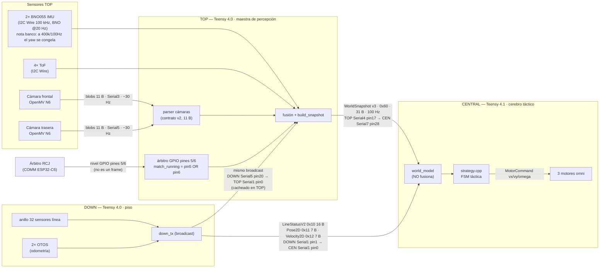
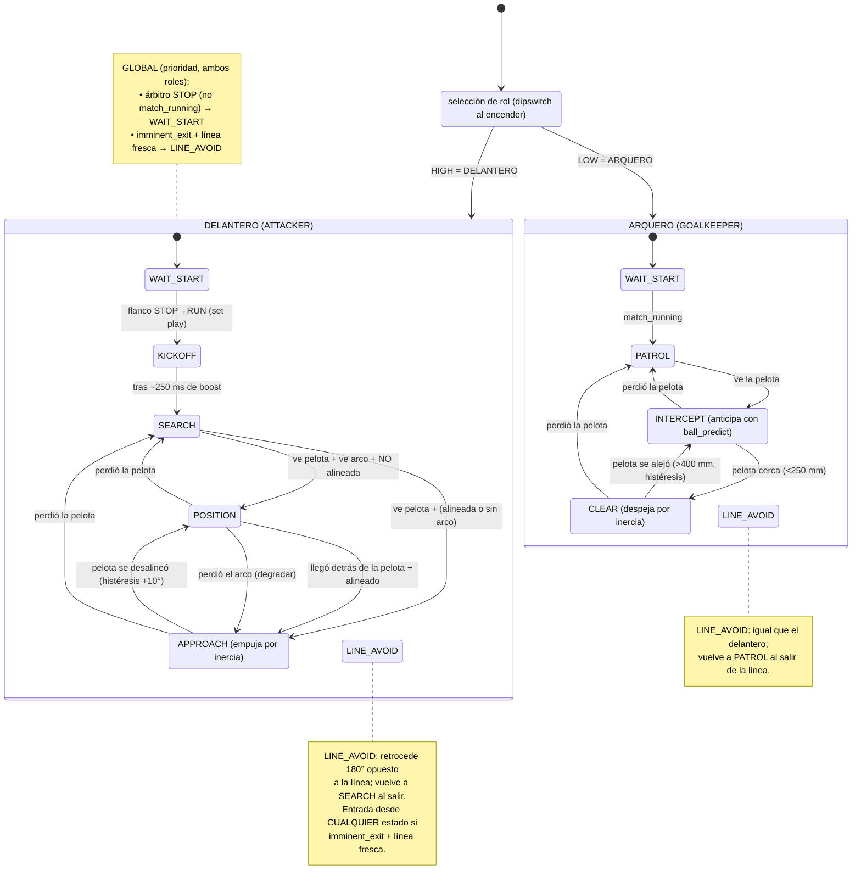

# Diagramas de arquitectura (Mermaid)

> **Qué es esto.** Dos diagramas en **Mermaid** (se renderizan solos en GitHub) que
> reemplazan los placeholders de figura del poster y del TDP **sin necesitar la
> cámara ni el banco**. Son verificables contra el código y los docs vivos.
>
> **Reemplazan estos placeholders:**
>
> | Placeholder | Dónde | Lo reemplaza |
> |---|---|---|
> | `[FOTO: diagrama de bloques renderizado del flujo de datos … Fig.2]` | `docs/competencia/POSTER.md` L159 | **Diagrama 1** |
> | `[DIAGRAM: rendered block diagram of the data flow … Fig.2]` | `docs/competencia/en/POSTER.md` L149 | **Diagrama 1** |
> | `[FOTO: pseudocódigo/flowchart de la FSM táctica … Fig.4]` | `docs/competencia/POSTER.md` L189 | **Diagrama 2** |
> | `[DIAGRAM: pseudocode/flowchart of the tactical FSM … Fig.4]` | `docs/competencia/en/POSTER.md` L179 | **Diagrama 2** |
> | `[DIAGRAM: FSM]` / `[DIAGRAM: flujo de datos]` (TDP) | `docs/competencia/TDP.md`, `en/TDP.md` | Diagramas 1 y 2 |
>
> **Fuentes de verdad usadas:** flujo de datos = `docs/MAPA-DE-DATOS.md` (al día,
> 2026-06-03). FSM = estados y transiciones REALES de
> `software/teensy/Soccer 2026/src/central/strategy.cpp`. Estos diagramas muestran
> **todos** los estados REALES del código — delantero: `WAIT_START`, `KICKOFF`,
> `SEARCH`, `POSITION`, `APPROACH`, `LINE_AVOID`; arquero: `WAIT_START`, `PATROL`,
> `INTERCEPT`, `CLEAR`, `LINE_AVOID`. **No existe un estado `PUSH`**: el empuje al
> arco ocurre dentro de `APPROACH` (y el despeje del arquero, dentro de `CLEAR`).

---

## Diagrama 1 — Flujo de datos de las 3 placas (Fig.2)

**Qué muestra (en llano).** Cómo viaja la información por el robot: el **TOP** es el
sentido (2 cámaras N6 + 2 BNO + 4 ToF + el árbitro por GPIO), fusiona todo y arma un
paquete `WorldSnapshot` que manda a la **CENTRAL** 100 veces por segundo. La
**DOWN** mira el piso (32 sensores de línea + 2 OTOS de odometría) y **difunde** su
estado a CENTRAL y a TOP. La **CENTRAL** es el cerebro: con lo que recibe corre la
FSM táctica y mueve los **3 motores omni**. El árbitro **no** viaja por UART: entra
al TOP como nivel digital en los pines 5/6 (`match_running = pin5 OR pin6`,
fail-safe) y después se reenvía adentro del `WorldSnapshot`.

> **Notas técnicas (banco / contratos) embebidas arriba — no borrar al simplificar:**
> - **WorldSnapshot v3 = 31 B, tipo `0x60`, @100 Hz**; cable real **TOP `Serial4` pin17 (TX4) → CENTRAL `Serial7` pin28 (RX7)** (mapeo corregido 2026-06-02: es `Serial4`, no `Serial7` del lado TOP).
> - **DOWN difunde** `LineStatusV2` (`0x10`, 16 B), `Pose2D` (`0x11`, 7 B) y `Velocity2D` (`0x12`, 7 B) a CENTRAL (`Serial1` pin1→pin0, validado en banco) **y** a TOP (`Serial5` pin20→TOP `Serial1` pin0, aún sin cablear; en TOP se cachean, todavía no se consumen).
> - **Árbitro = nivel GPIO**, NO UART: pines 5/6 con `INPUT_PULLDOWN`, `match_running = pin5 OR pin6` (en PLAY el COMM sube **un solo** pin → AND no servía; OR sí; fail-safe = cable suelto → ambos 0 → STOP). TASK-039, banco 2026-06-02.
> - **I2C del TOP a 100 kHz**: a 400 kHz el read del BNO **secundario** (en `Wire`, junto a los ToF) choca con los ToF y el yaw se congela; a 100 kHz coexisten. El **primario** vive aparte en `Wire2` (sin ToF) → no sufre contención. Robot corre **2 BNO (ambos 0x28, buses separados) + 4 ToF**; ambos BNO sanos (heading validado en banco 2026-06-21). NO hay ningún BNO en 0x29.
> - **CENTRAL no fusiona** (toma el heading del snapshot del TOP) y **no tiene BNO**.
> - **OTOS dependen de batería** → el refinamiento drive-straight es opcional y con fallback exacto al comportamiento sin OTOS.

---

## Diagrama 2 — FSM táctica (Fig.4)

**Qué muestra (en llano).** El "árbol de decisiones" que corre la CENTRAL 100 veces
por segundo. El robot puede jugar de **DELANTERO** o de **ARQUERO** (se elige por
dipswitch al encender). Cada rol tiene su propia máquina de estados. Dos reglas
**pisan** cualquier estado: si el árbitro pone **STOP** se vuelve a `WAIT_START`, y
si la línea blanca está por salirse del campo se entra a `LINE_AVOID` para retroceder.
Sin kicker físico: tanto el delantero como el arquero **empujan** la pelota por
inercia (no disparan nada).

> Estados verificados 1:1 contra `strategy.cpp` (`enum class AtkState` y
> `enum class GkState`). **No hay estado `PUSH`** como tal: el "empuje" sucede dentro
> de `APPROACH` (delantero) / `CLEAR` (arquero), donde el robot avanza derecho a la
> pelota. `EMERGENCY_LINE` (corte duro de línea) se maneja en `main_central.cpp`
> ANTES de la FSM (bypassa `strategy_tick`); dentro de la FSM el manejo de línea
> normal es `LINE_AVOID`.

> **Notas técnicas embebidas (no borrar al simplificar):**
> - **omega clamp ≤ 327**: `omega*100` es `int16`; con 360 desbordaba y el giro se
>   invertía. Todo el ω de la FSM pasa por `omega_degps_to_centideg()` que satura el
>   `int16` (anti sign-flip). Por eso ningún estado puede mandar un giro fuera de rango.
> - **Sin kicker físico**: el delantero empuja la pelota dentro de `APPROACH` y el
>   arquero dentro de `CLEAR` avanzando derecho (inercia mecánica). El arquero **ya
>   anticipa** con `ball_predict` en `INTERCEPT` (X predicha con lead) y refuerza la
>   respuesta si la trayectoria va al arco propio (`bt_classify` → `BT_TO_OWN_GOAL`).
> - **Refinamientos OTOS / cross_track con fallback EXACTO**: el drive-straight (OTOS)
>   y el strafe paralelo a la línea (cross_track real) solo actúan si el dato está
>   fresco; si no, el comportamiento es byte-idéntico al previo. No cambian el árbol
>   de estados.
> - **`heading_valid` gate (schema v3)**: si el BNO aún no convergió (heading=0 falso
>   al boot) la FSM no orienta con ese rumbo ese tick (ω=0), sin romper el resto.

---

### Cómo regenerar / verificar

- Estos bloques se renderizan automáticamente en GitHub (Markdown + Mermaid). No
  requieren herramientas externas ni la cámara.
- Si cambian los estados de la FSM, re-verificar contra los `enum class AtkState` /
  `enum class GkState` de `software/teensy/Soccer 2026/src/central/strategy.cpp`.
- Si cambia un contrato de wire (tamaño/tipo/cable), la fuente es
  `docs/MAPA-DE-DATOS.md` (que a su vez indexa `src/shared/types.h`, `proto.h` y los
  `CONTRATO-DATOS-*.md`).
