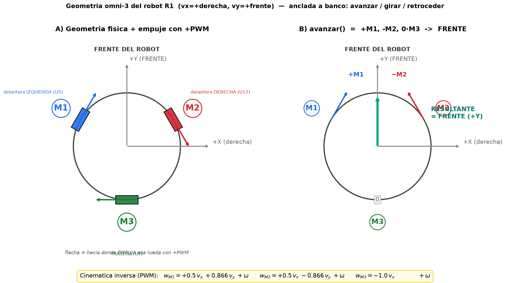

# Cinemática omni-3 del robot R1 — derivación anclada a banco

> **Para qué.** Documenta la cinemática inversa del robot (cómo `(vx, vy, ω)` → PWM de cada rueda),
> **reconstruida desde las primitivas ya probadas en banco** y **verificada con Elías el 2026-06-23**.
> La usa la primitiva `mix_mover_vector()` del rodeo estilo Edge (`src/centralmix/`). Reusable para
> 2027 (es la geometría del robot, no de un programa puntual).
>
> **Por qué no `src/shared/kinematics.cpp`.** El equipo reportó que esa librería "no anda bien" al
> usarla desde `strategy.cpp`. Reconstruyendo desde cero se ve que **la fórmula está bien**; lo que
> rompe en la práctica es otra cosa (ver §4). `mix_mover_vector` evita esos problemas trabajando en
> PWM directo.

## 1. Geometría



- **Frame del robot:** `+X` = derecha, `+Y` = frente, `ω` + = antihorario (CCW) visto desde arriba.
- **Motores (físico, confirmado por Elías):** `M1` = delantera **izquierda** (U5), `M2` = delantera
  **derecha** (U17), `M3` = **trasera** (U7).
- **Convención de signo por rueda** (`mix_set_motor`, confirmada por Elías): viendo la rueda de frente,
  **horario = `−PWM`, antihorario = `+PWM`** — igual que en `avanzar()`.

## 2. La matriz (PWM directo)

```
w_M1 = +0.5·vx + 0.866·vy + ω
w_M2 = +0.5·vx − 0.866·vy + ω
w_M3 = −1.0·vx +    0     + ω
```

donde `vx` = componente derecha, `vy` = componente frente, y `ω` = el **mismo** valor sumado a las 3
ruedas (giro puro — las 3 están al mismo radio, así que `ω·R` es idéntico; sumarlo a las 3 NO inyecta
traslación, igual que `girar()`). Para moverse en un ángulo `φ` (0=frente, +=derecha):
`vx = speed·sin(φ)`, `vy = speed·cos(φ)`.

## 3. Cómo se ancló a banco (no es teoría suelta)

Cada columna de la matriz sale de una primitiva que el equipo YA probó en el robot real:

| Primitiva (banco) | PWM por rueda | Lo que fija | ¿Coincide la matriz? |
|---|---|---|---|
| `avanzar()` (frente) | `[+, −, 0]` | columna `vy`: `[+0.866, −0.866, 0]` | ✅ exacto |
| `retroceder2` (atrás) | `[−, +, 0]` | `vy` (negado) | ✅ exacto |
| `girar()` (en el lugar) | `[−, −, −]` | columna `ω`: las 3 IGUAL | ✅ |
| `retroceder1` (escapa der+adel) | `[+, 0, −]` | columna `vx`: dominante `[+, ~0, −]` | ✅ (la rueda en 0 es la chica) |
| `retroceder3` (escapa izq+adel) | `[0, −, +]` | `vx` (otro signo): `[~0, −, +]` | ✅ |

Los `retroceder1/3` fueron **re-tuneados por Elías en banco** (commit `e83d43c`), así que valen como
verdad física. La matriz reproduce el patrón de signos de las 5 primitivas.

### Posiciones físicas vs el `{330,210,90}` del repo
La dirección de **empuje** de cada rueda con `+PWM` (panel A del diagrama) es: M1→60° (adelante-derecha),
M2→−60° (atrás-derecha), M3→180° (izquierda). Eso corresponde a posiciones físicas **M1=150°, M2=30°,
M3=270°** (front-left / front-right / rear), que es lo que se ve en el robot. El `{330,210,90}` que
aparece en comentarios del repo es ese conjunto **+180°** (una elección de signo equivalente para la
fórmula `v_i=-vx·sin+vy·cos+ωR`); da la MISMA matriz. No es contradicción, es la misma geometría escrita
con otro signo.

## 4. Por qué `kinematics.cpp` "no anda" aunque la fórmula esté bien

La fórmula `v_i = -vx·sin(θ_i) + vy·cos(θ_i) + ω·R` es correcta. Los sospechosos reales de que "no
ande" al cablearla en `strategy.cpp` son:

1. **Signo de ω** — `config_central.h` tiene `OMEGA_SIGN = -1`, documentado como "el único caso de
   realimentación POSITIVA del repo" (el rumbo se iba `-3.7 → -71.5`). Un signo de giro mal = el robot
   persigue su error.
2. **Piso de motor / zona muerta** — `apply_pwm_floor` viene en `min_pwm = 0` (off) → a PWM bajo las
   ruedas no arrancan (zumban). Traslación lenta = no se mueve.
3. **Calibración `mm/s → PWM`** (`max_speed_mm_s`) — si está mal, todo el escalado sale torcido.

`mix_mover_vector` esquiva los 3: trabaja **en PWM directo** (sin `mm/s` ni `max_speed`), satura por
**escalado** (preserva la dirección) y deja el **signo de ω como perilla** (`MIX_EDGE_FACE_KP`).

## 5. Reproducir el diagrama

`docs/firmware/assets/cinematica-omni-r1-geometria.py` (matplotlib). `python3 …py` → regenera el PNG.

## 6. Verificación host

La matriz vive en `mix_mover_vector()` (`src/centraledge/mix_motors.cpp`). La curva de rodeo que la usa
está testeada en `test/test_mix_edge/` (11/11). El sentido físico final se confirma en banco — **TASK-119**.
