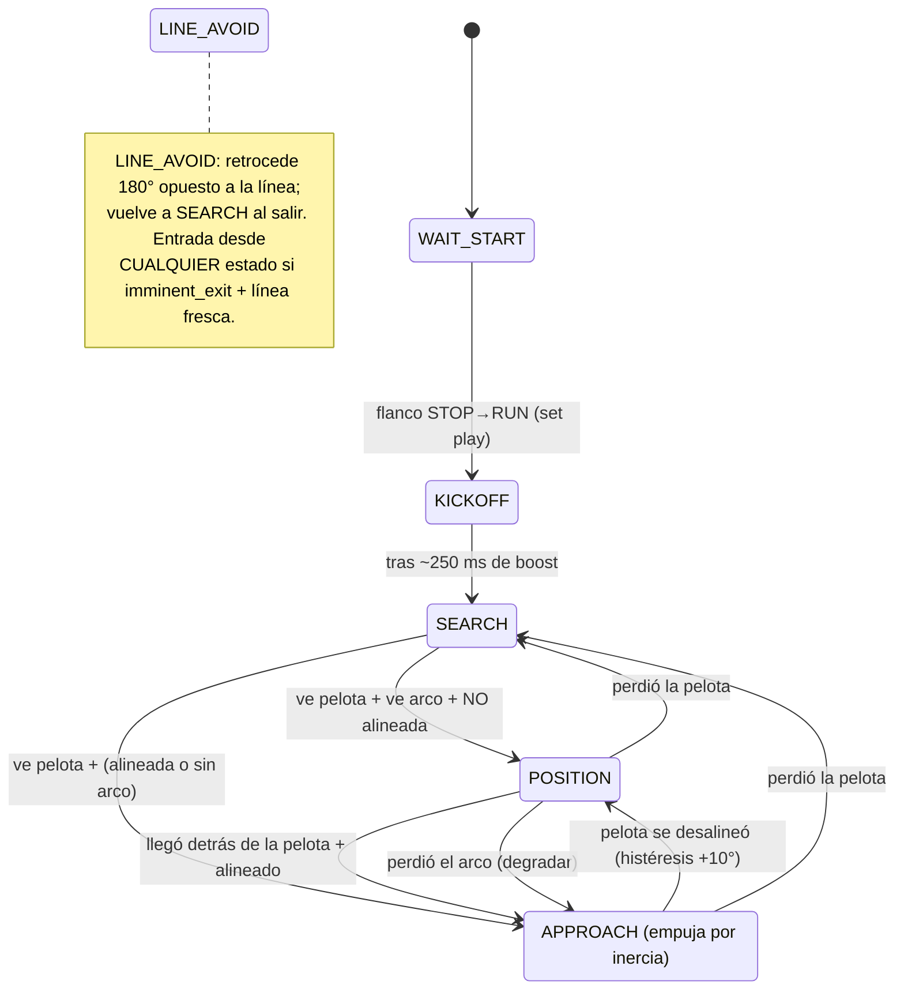
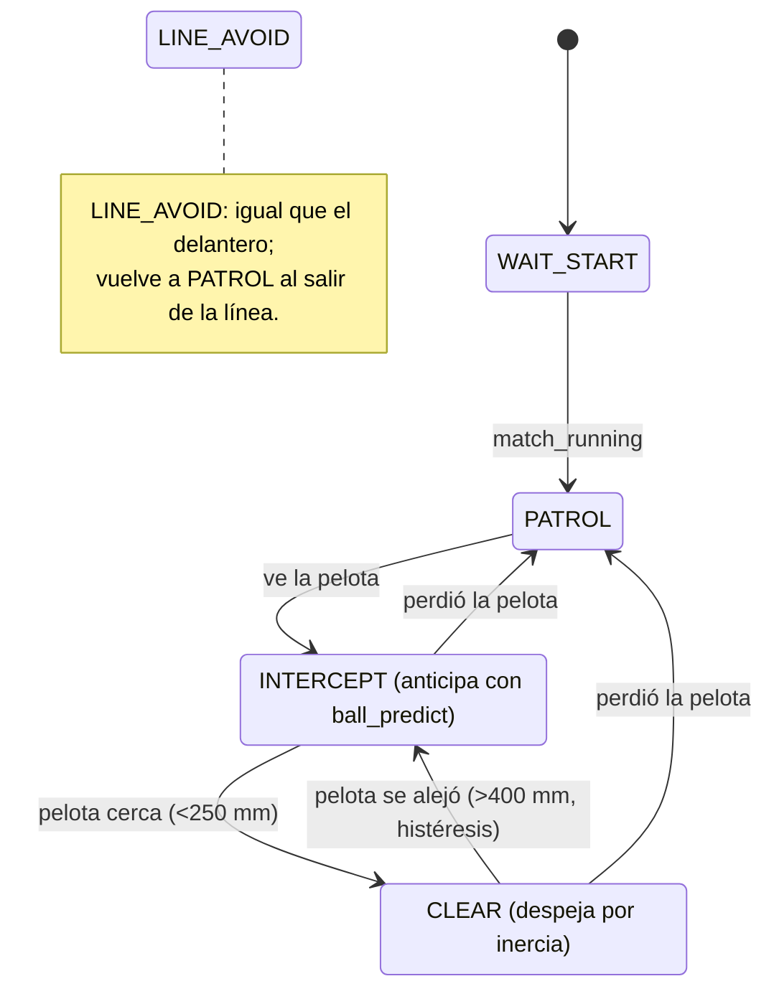

# Estrategia de alto nivel del robot

> **Para quién es esto.** Para cualquiera del equipo que quiera entender qué
> "piensa" el robot y mejorar su juego, sin tener que leer todo el `strategy.cpp`
> línea por línea. Todo lo de acá está **verificado contra el código** (no es un
> diseño aspiracional). Donde el código y un diseño viejo difieren, mandamos lo
> que **corre hoy** y lo aclaramos.
>
> **Una advertencia de honestidad.** El cerebro táctico (esta FSM) **ya anda** y
> está en verde (gate host: 566 tests / 41 envs / 0 fallos, main `904a5cd`). El
> bloqueante real #1 para Incheon **NO es la estrategia**: es la **visión sin
> recalibrar** (TASK-022). Una FSM perfecta con una cámara que no ve la pelota no
> mete goles. Tenelo presente al priorizar.

---

## 1. Resumen en un párrafo (en criollo)

El robot juega de **delantero** o de **arquero** según un interruptor que se fija
**al encender** (no cambia durante el partido). Cien veces por segundo, la placa
**CENTRAL** lee un "resumen del mundo" (`WorldSnapshot`) que arma la placa de
**arriba** con las cámaras, las IMU y los ToF, más lo que difunde la placa de
**abajo** (línea blanca + odometría). Con ese resumen corre una **máquina de
estados** (FSM): el delantero busca la pelota, se ubica detrás de ella mirando al
arco rival, y la **empuja por inercia** (no tiene pateador físico); el arquero
patrulla su arco, **anticipa** dónde va a estar la pelota y la despeja cuando se le
acerca. Por encima de todo hay un **freno de emergencia**: si la placa de abajo
avisa que el robot está por salirse de la cancha, CENTRAL frena al toque (en menos
de 15 ms), sin esperar el ciclo normal de decisión. Todo lo que decide la FSM se
expresa en tres números — avance lateral (vx), avance al frente (vy) y giro (omega)
— que recién después se convierten en velocidades de las 3 ruedas omni.

---

## 2. Arquitectura en 3 capas (+ el bypass de emergencia)

La CENTRAL piensa en **tres capas**, de la más "inteligente" a la más "bruta".
Cada capa se puede tunear sin tocar las otras. (Ver `FIRMWARE-PLACA-CENTRAL.md §3`.)

```
   ┌──────────────────────────────────────────────────────────────────────┐
   │  CAPA ALTA — Estrategia / FSM         (strategy.cpp, 100 Hz)          │
   │  Decide QUÉ hacer: buscar, posicionarse, atacar, defender, despejar.  │
   │  Salida: MotorCommand { vx_mm_s, vy_mm_s, omega_centideg_s }          │
   └───────────────────────────────┬──────────────────────────────────────┘
                                   │  (vx, vy, omega)
   ┌───────────────────────────────▼──────────────────────────────────────┐
   │  CAPA MEDIA — Lazos de control (PIDs)  (pids.cpp)                     │
   │  HeadingPID (a dónde apunta el frente) + LateralPID (arquero pega     │
   │  la línea por cross_track). Convierten "quiero mirar ahí" en omega    │
   │  acotado y "quiero pegarme a la línea" en vx.                         │
   └───────────────────────────────┬──────────────────────────────────────┘
                                   │  (vx, vy, omega ya corregidos)
   ┌───────────────────────────────▼──────────────────────────────────────┐
   │  CAPA BAJA — Cinemática omni-3 + motores Zircon  (motors_zircon.cpp)  │
   │  Convierte (vx, vy, omega) en velocidad de cada una de las 3 ruedas,  │
   │  satura proporcional y manda PWM al driver Zircon.                    │
   └──────────────────────────────────────────────────────────────────────┘
```

**Por qué importa el orden.** La capa alta **no** sabe de ruedas ni de PWM; solo
dice "andá para allá y mirá para allá". La cinemática inversa **no** vive en
`strategy.cpp` — vive en `motors_zircon`. Eso permite tunear la táctica y la
mecánica por separado (lo dice el encabezado de `strategy.cpp`).

### El bypass EMERGENCY_LINE (freno de borde, < 15 ms)

Hay **una excepción** que se salta toda la FSM: el **freno de borde**. Vive en
`main_central.cpp`, **antes** de llamar a `strategy_tick()`:

```cpp
// main_central.cpp (loop principal), ANTES de la FSM:
if (world_model_imminent_exit() && world_model_line_is_fresh()) {
    motors_brake();                       // freno ACTIVO (corto en H-bridge), no solo PWM=0
    digitalWrite(PIN_LED_STATUS, HIGH);   // LED fijo = alerta visual
    return;                               // no corre la FSM este loop
}
```

- **Qué hace.** Si la placa de **abajo** detecta que la línea blanca es inminente
  (`imminent_exit`) y ese dato es **fresco**, CENTRAL frena **ya**, en cada vuelta
  del loop, sin esperar al tick de 100 Hz de la estrategia. Por eso el freno llega
  en **< 15 ms** desde que abajo ve el borde.
- **No sale del loop.** Hace `return` de ese ciclo pero sigue leyendo los UART, así
  se entera cuándo abajo baja la alerta y recupera el control en el próximo tick.
- **`EMERGENCY_LINE` ≠ `LINE_AVOID`.** El freno duro está **fuera** de la FSM. El
  `LINE_AVOID` (estado de la FSM, ver §3 y §4) es la **recuperación** que retrocede
  hacia adentro de la cancha **después** del freno. Son dos cosas distintas.
- ⚠️ **Pendiente de banco (audit 2026-06-04):** falta confirmar en el Zircon que
  `motors_brake()` de verdad frene (corto HIGH/HIGH en el H-bridge) y no quede en
  COAST (rueda libre). Medirlo antes de confiarle el borde.

### El rol se fija al boot

El rol (delantero/arquero) **no** cambia durante el partido: se fija una sola vez
en `setup()`. Hoy en el código se elige por **build flag** (`apply_role_from_dipswitch()`
en `main_central.cpp`): `ROBOT1` → arquero (`GOALKEEPER`), `ROBOT2` → delantero
(`ATTACKER`). El diseño previsto es leerlo de un **dipswitch** físico (ver
`strategy.h`: `LOW = arquero`, `HIGH = delantero`); por ahora está cableado por
flag de compilación, un robot por rol.

---

## 3. FSM del DELANTERO (ATTACKER)

Estados (de `enum class AtkState` en `strategy.cpp`):
`WAIT_START · KICKOFF · SEARCH · POSITION · APPROACH · LINE_AVOID`.

### Qué decide cada estado y por qué

| Estado | Qué hace | Por qué |
|--------|----------|---------|
| **WAIT_START** | Motores quietos (`cmd` vacío). | Mientras el árbitro no diga RUN no nos movemos (regla RCJ + seguridad). |
| **KICKOFF** | Boost recto al frente a `vy=500 mm/s` durante `250 ms`, manteniendo el heading actual (no rota). | Set play de saque: arrancar fuerte hacia adelante al sonar el RUN, sin perder tiempo buscando. Si el OTOS está fresco, refina el avance para que salga **derecho** (drive-straight); si no, fallback exacto sin OTOS. |
| **SEARCH** | Recorre la cancha: avanza lento (`vy=200`) girando despacio (`omega=60°/s`). | Si no vemos la pelota, hay que barrer el campo hasta encontrarla. |
| **POSITION** | "Behind-the-ball": va al punto que queda **detrás** de la pelota sobre la línea pelota→arco (gap `120 mm`), siempre mirando al arco rival. | Si embestimos la pelota desde cualquier lado, la mandamos para cualquier lado. Hay que ponerse **detrás** para que al empujarla, vaya al arco rival. |
| **APPROACH** | Va **derecho a la pelota** con perfil de velocidad suave (200–600 mm/s), orientando el frente hacia ella, y la **empuja por inercia**. | Una vez alineados, el robot avanza y empuja (no hay kicker físico). Si el OTOS está fresco, cancela la deriva lateral para que el empuje salga derecho. |
| **LINE_AVOID** | Retrocede 180° **opuesto** a la línea detectada, a `400 mm/s`. | Recuperación post-freno: meterse de nuevo en la cancha. Vuelve a `SEARCH` al salir del borde. |

> **Detalle clave (por qué SEARCH se bifurca por ÁNGULO, no por distancia).** Al
> ver la pelota, si **también** vemos el arco rival y la pelota **no** está alineada
> con la línea robot→arco (fuera de ±30°), vamos primero a `POSITION` a rodearla.
> Si ya está alineada (o no vemos el arco), vamos directo a `APPROACH`. El criterio
> es `ball_is_in_attack_line(...)`, **no** una distancia. (Corrige el diseño viejo
> que cortaba por `<250 mm`.)
>
> **El "empuje alineado" no es un estado.** No existe un `PUSH` separado. Dentro de
> `APPROACH`, cuando la pelota está cerca (`≤80 mm`) y el frente apunta al arco
> (`|ángulo| ≤12°`), se evalúa `is_aligned_to_push(...)` solo para **documentar** ese
> punto; el robot **sigue empujando** igual (sin kicker físico, el chequeo queda como
> gancho para una conducta futura).

### Tabla de transiciones exacta (verificada en `strategy.cpp`)

**Transiciones globales prioritarias** (pisan cualquier estado, en este orden):

| # | Condición | Va a |
|---|-----------|------|
| 1 | `!match_running` (árbitro STOP) | `WAIT_START` |
| 2 | `imminent_exit && line_fresh` | `LINE_AVOID` |
| 3 | flanco STOP→RUN de `match_running` | `KICKOFF` (y arranca el timer) |

**Transiciones internas:**

| Transición | Condición real (código) |
|------------|--------------------------|
| WAIT_START → KICKOFF | flanco STOP→RUN de `match_running` (vía global #3) |
| KICKOFF → SEARCH | `now − kickoff_start ≥ 250 ms` |
| SEARCH → POSITION | `ball_visible` **y** `goal_opp_visible` **y** pelota **fuera** de ±30° de la línea al arco |
| SEARCH → APPROACH | `ball_visible` **y** (`!goal_opp_visible` **o** pelota **dentro** de ±30°) |
| POSITION → APPROACH | `tdist < 80 mm` (llegó al target) **y** alineada (±30°); **o** se perdió el arco (`!goal_opp_visible`) |
| POSITION → SEARCH | `!ball_visible` |
| APPROACH → POSITION | `goal_opp_visible` **y** pelota **fuera** de ±40° (histéresis +10° sobre los 30°) |
| APPROACH → SEARCH | `!ball_visible` **o** `ball_dist < 1 mm` |
| cualquiera → WAIT_START | `!match_running` |
| cualquiera → LINE_AVOID | `imminent_exit && line_fresh` |
| LINE_AVOID → SEARCH | `!imminent_exit` |

> **Constantes reales** (en `strategy.cpp`, sección "Tuning constants"):
> `ATK_SEARCH_VY=200`, `ATK_SEARCH_OMEGA=60°/s`, `ATK_BEHIND_BALL_GAP=120 mm`,
> `ATK_ATTACK_LINE_TOL=30°` (histéresis APPROACH usa `+10°` → 40°),
> `ATK_POSITION_REACHED=80 mm`, `ATK_KICK_DIST=80 mm`, `ATK_KICK_ANGLE=12°`,
> `ATK_APPROACH_MAX=600`, `ATK_APPROACH_MIN=200`, `ATK_KICKOFF_SPEED=500`,
> `ATK_KICKOFF_DURATION=250 ms`, `ATK_LINE_RETREAT=400`.

### Diagrama (Mermaid)

Reusa el **Diagrama 2** de `docs/competencia/assets/diagramas.md` (verificado 1:1
contra `enum class AtkState`). Reproducido acá la parte del delantero:



---

## 4. FSM del ARQUERO (GOALKEEPER)

Estados (de `enum class GkState` en `strategy.cpp`):
`WAIT_START · PATROL · INTERCEPT · CLEAR · LINE_AVOID`.

### Qué decide cada estado y por qué

| Estado | Qué hace | Por qué |
|--------|----------|---------|
| **WAIT_START** | Motores quietos. | Igual que el delantero: sin RUN no se mueve. |
| **PATROL** | Oscila lateral sobre el arco (`±150 mm/s`, período `2000 ms`) **pegado a la línea** vía PID lateral por `cross_track`. Si ve el arco propio (y heading válido), orienta el frente hacia la cancha. | Cubrir el ancho del arco esperando la pelota, sin despegarse de la línea de gol. |
| **INTERCEPT** | Sigue la **X PREDICHA** de la pelota (no la actual) con `vx = X_pred · Kp`, más corrección lateral del PID. Mantiene el frente hacia la cancha. | Anticipar: ir a donde la pelota **va a estar**, no a donde está. Si el tiro va al arco propio (amenaza), refuerza la respuesta (más lead + más ganancia). |
| **CLEAR** | Va **derecho a la pelota** a `500 mm/s` (sin PID lateral, ahora ataca la pelota) y la **empuja** por inercia. | Cuando la pelota está encima, dejar de defender y sacarla de la zona. |
| **LINE_AVOID** | Retrocede 180° opuesto a la línea, a `250 mm/s`. Vuelve a `PATROL` al salir. | Igual que el delantero: recuperación de borde. |

### Las dos mejoras "inteligentes" del arquero (con fallback exacto)

1. **Anticipación por `ball_predict` (INTERCEPT).** En vez de seguir la X **actual**
   de la pelota, apunta a la X **predicha** dentro de `lookahead_s` usando la
   velocidad de la pelota del snapshot (`ball_vx/vy`). Si la velocidad es N/A o la
   pelota está quieta, el lead es 0 → `X_pred = X_actual` → conducta **idéntica** a
   antes (fallback automático). ⚠️ `lookahead_s` y `max_lead_mm` se tunean en banco.

2. **Clasificación de trayectoria (`bt_classify`) + respuesta a amenaza.** El arquero
   distingue si el tiro va al **arco propio** (`BT_TO_OWN_GOAL` = amenaza real) o no.
   Si es amenaza, re-predice la X con **más lead** (`×GK_BT_THREAT_LEAD_FACTOR=1.5`) y
   sube la ganancia del eje X (`×GK_BT_THREAT_KP_FACTOR=1.5`). **Fallback exacto:** en
   cualquier otra rama (pelota quieta, va al rival, cruza, o sin arco rival visible)
   ambos factores valen `1.0` → comando **byte-idéntico** al previo. La amenaza solo
   **multiplica**, nunca cambia el signo ni el camino del fallback. ⚠️ Tunear los dos
   factores en banco (muy alto sobre-anticipa y deja hueco; muy bajo no aporta).

3. **Strafe paralelo a la línea por `cross_track` (PATROL/INTERCEPT).** El PID lateral
   lleva la **distancia perpendicular firmada a la línea** (`cross_track`, calculado en
   `down_model`) a un setpoint de `0 mm` (centrado sobre la línea). Combinado con la
   oscilación de PATROL / el seguimiento de bola de INTERCEPT (que mueven el eje X), el
   arquero se desplaza **paralelo** a la línea de gol. **Fallback exacto:** si el
   `cross_track` es N/A (anillo parcial, sin blancos validados, o DOWN sin Capa 3), usa
   la señal previa por **profundidad** (`depth`); y si la línea no está fresca, devuelve
   `0` (sin corrección), idéntico a antes.

### Tabla de transiciones exacta (verificada en `strategy.cpp`)

**Transiciones globales prioritarias** (igual que el delantero, **sin** KICKOFF):

| # | Condición | Va a |
|---|-----------|------|
| 1 | `!match_running` | `WAIT_START` |
| 2 | `imminent_exit && line_fresh` | `LINE_AVOID` |

**Transiciones internas:**

| Transición | Condición real (código) |
|------------|--------------------------|
| WAIT_START → PATROL | `match_running` |
| PATROL → INTERCEPT | `ball_visible` |
| INTERCEPT → CLEAR | `dist < GK_CLEAR_TRIGGER_MM` (250 mm) — gana sobre `!ball_visible` |
| INTERCEPT → PATROL | `dist ≥ 250 mm` **y** `!ball_visible` |
| CLEAR → PATROL | `!ball_visible` — gana sobre el chequeo de release |
| CLEAR → INTERCEPT | `ball_visible` **y** `dist > GK_CLEAR_RELEASE_MM` (400 mm) |
| cualquiera → LINE_AVOID | `imminent_exit && line_fresh` |
| LINE_AVOID → PATROL | `!imminent_exit` |

> **Histéresis 250/400 mm (INTERCEPT↔CLEAR).** Entra a CLEAR cuando la pelota está a
> **< 250 mm** (`GK_CLEAR_TRIGGER_MM`) y solo vuelve a INTERCEPT cuando se aleja a
> **> 400 mm** (`GK_CLEAR_RELEASE_MM`). Esa banda muerta evita el ping-pong de estado
> cuando la pelota queda justo en el umbral.
>
> **Otras constantes reales:** `GK_PATROL_SPEED=150`, `GK_PATROL_OSCILLATE_PERIOD=2000 ms`,
> `GK_INTERCEPT_KP_VS_BALL_X=4.0`, `GK_CROSS_TRACK_SETPOINT=0 mm`, `GK_CLEAR_SPEED=500`,
> `GK_LINE_RETREAT=250`, `GK_BT_SPEED_MIN=80 mm/s` (debajo de eso → pelota quieta),
> `GK_BT_TOWARD_TOL=4500 centideg` (±45°: cono "va hacia el arco").

### Diagrama (Mermaid)

Parte del arquero del Diagrama 2 de `diagramas.md`:



---

## 5. Niveles de estrategia

(`FIRMWARE-PLACA-CENTRAL.md §8` — tabla de estado de implementación.)

| Nivel | Qué agrega | Estado |
|-------|-----------|--------|
| **Nivel 1** (Incheon mínimo) | **Delantero:** WAIT_START → SEARCH → APPROACH (ir directo a la pelota). **Arquero:** WAIT_START → PATROL → INTERCEPT (seguir la X de la pelota). Todo en **coordenadas relativas al robot**, sin pose absoluta. | ✅ implementado |
| **Nivel 2** (este `strategy.cpp`) | **Delantero:** + `KICKOFF` (set play inicial) + `POSITION` (behind-the-ball **relativo**) + empuje alineado dentro de `APPROACH`. **Arquero:** + `CLEAR` (despeje con histéresis) + anticipación `ball_predict` + clasificación de amenaza `bt_classify` + strafe por `cross_track`. `LINE_AVOID` como estado explícito. Refinamientos OTOS (drive-straight) con fallback exacto. | ✅ implementado |
| **Nivel 3** (futuro) | **Juego posicionado por POSE ABSOLUTA:** orbit suave continuo, set plays con posiciones fijas (`KICKOFF_OWN/ADV`), targets absolutos (delante de la pelota apuntando al arco con coordenadas de cancha), y a futuro coordinación de partner y modelo del rival. | ⏳ futuro (ver §6) |

**La diferencia de fondo entre Nivel 2 y Nivel 3.** Hoy (Nivel 2) el robot razona
**relativo a sí mismo**: "la pelota está 30° a mi derecha, a 400 mm; el arco está
a 10° a mi izquierda". No sabe **dónde está en la cancha**. El Nivel 3 agrega esa
pieza que falta — **la pose absoluta** (mi x, y, heading en el marco de la cancha) —
y con eso puede jugar **posicionado**: "estoy en (700, 1500), la pelota en
(900, 1800), el arco rival en (910, 2310), así que mi target es (880, 1750)".

---

## 6. ROADMAP de Nivel 3 — juego posicionado por pose absoluta

> **Esta es la parte clave.** El Nivel 3 = **JUEGO POSICIONADO por POSE ABSOLUTA**.
> El árbol de estados casi no cambia: lo que cambia es **cómo se calcula el target**
> en un par de estados, cuando exista una pose absoluta confiable.

### Las piezas (qué ya existe y qué se agrega en este batch)

**(a) Producir la pose absoluta — YA EXISTE como módulos puros, sin cablear.**

- **`src/shared/localization`** (`localization_compute`): **trilateración** geométrica
  directa con los 4 ToF cardinales + heading del BNO → pose absoluta `(x, y, heading)`
  en el marco de cancha. Precisión esperada ±2–3 cm. **Pura, host-testeable.** ⚠️ Con
  el HW actual casi nunca da `valid` (salta, intermitente) — por eso no alcanza sola.
- **`src/shared/pose_fusion`** (`pose_fusion_update`): **filtro complementario** que
  integra el **delta** de la OTOS (predicción suave, 100 Hz) sobre la pose fusionada y,
  cuando hay pose ToF válida y consistente, **tira suavemente hacia ella** (corrección:
  `pose += K·(pose_tof − pose)`) para anclar al absoluto y matar el drift. **No fusiona
  heading** (siempre del BNO, pass-through). **Pura, host-testeable.**

Juntos resuelven el problema de "los dos mapas": ToF es absoluto pero salta; OTOS es
suave pero deriva. La fusión da una pose absoluta **suave y anclada**.

**(b) Calcular targets absolutos — MÓDULOS NUEVOS de este batch.**

- **`src/shared/behind_ball_abs`** (nuevo): el equivalente **absoluto** de
  `compute_behind_ball_target`. Hoy el behind-the-ball trabaja **relativo** (gap detrás
  de la pelota usando el ángulo al arco). La versión `_abs` calcula el punto detrás de
  la pelota usando **coordenadas de cancha** (`my_x/y`, `ball_x/y`, `OPP_GOAL` ≈
  `(910, 2310)`), exactamente el diseño de `FIRMWARE-PLACA-CENTRAL.md §8.4`.
- **`src/shared/pose_targeting`** (nuevo): helpers para convertir "quiero estar en esta
  posición de cancha mirando a este punto" en el `(vx, vy, omega)` relativo que la FSM
  ya sabe consumir (rotando el vector cancha→robot por el heading absoluto).

> **Estos dos módulos nacen PUROS y NO cableados** (host-testeables, sin Arduino/Wire,
> `#pragma once`, `namespace iitasoccer`, solo `<stdint.h>`/`<cmath>`/`<stddef.h>`). El
> runner host compila todo `src/shared/*.cpp` contra cada test, así que se linkean
> solos. **El binario de competencia NO cambia** hasta que alguien decida cablearlos.

**(c) Cómo se enchufan en `strategy.cpp` — cuando la pose sea confiable.**

`strategy.cpp` llamaría a estos módulos **en lugar de** la versión relativa, en los
estados donde la pose absoluta da una ventaja real:

| Rol | Estado | Hoy (Nivel 2, relativo) | Nivel 3 (absoluto, cuando la pose sea confiable) |
|-----|--------|--------------------------|--------------------------------------------------|
| Delantero | `POSITION` | `compute_behind_ball_target` (relativo, gap 120 mm) | `behind_ball_abs` con `my_x/y` + `OPP_GOAL` de cancha |
| Arquero | `PATROL` | oscila sobre la línea por `cross_track` | plantarse en la posición **absoluta** del arco (centro de gol) |
| Arquero | `INTERCEPT` | sigue la X **relativa** predicha de la pelota | interceptar sobre la línea de gol **absoluta** (proyectar la trayectoria a la y del arco) |

### Plan de staging seguro (cómo NO romper lo que anda)

> **Hoy NO se cablea nada.** El cerebro táctico anda y está en verde; el bloqueante
> real #1 es la **visión** (TASK-022), no la estrategia. Cablear pose absoluta ahora
> solo agrega riesgo sin resolver el cuello de botella.

El enganche se hace **con fallback exacto y gateado**, recién **tras validar la pose
en banco**. Patrón (igual al que ya usan `ball_predict`, `cross_track` y OTOS hoy):

```text
si (pose_absoluta_confiable)   →  usar target ABSOLUTO (behind_ball_abs / pose_targeting)
si no                          →  fallback EXACTO al target RELATIVO actual (byte-idéntico)
```

Con ese gate, el día que la pose no esté disponible o no sea confiable, el robot se
comporta **exactamente** como hoy. La mejora **solo** actúa con dato bueno presente.

**Orden de trabajo (no saltear pasos):**

1. **Recalibrar la visión (TASK-022).** Bloqueante real #1. Sin cámara que vea la
   pelota y los arcos, nada de lo de arriba importa.
2. **Validar trilateración + `pose_fusion` en banco.** Confirmar que
   `localization_compute` da `valid` razonable y que `pose_fusion_update` produce una
   pose **suave y anclada** (±2–3 cm, sin saltos ni drift). Atar cabos de banco
   pendientes: signo del BNO (CW vs CCW), `WHEEL_ANGLES`, signo del eje X de la cámara.
3. **Cablear `behind_ball_abs` / `pose_targeting` con fallback al relativo.** Recién
   cuando 1 y 2 estén verdes en banco. Enchufar en `POSITION` (delantero) y
   `PATROL`/`INTERCEPT` (arquero) detrás del gate `pose_absoluta_confiable`. Verificar
   que con el gate en `false` el comando es byte-idéntico al de hoy (no-regresión).

---

## 7. Qué falta para Nivel 3 (checklist)

- [ ] **Visión recalibrada (TASK-022)** — bloqueante #1. LAB recalibrado en las 2 N6.
- [ ] **Trilateración validada en banco** — `localization_compute` da `valid`
      consistente con el HW real (4 ToF; hoy 4/4 estables, 1 BNO 0x28).
- [ ] **`pose_fusion` validada en banco** — pose suave + anclada, sin saltos/drift,
      gating ToF/OTOS funcionando; tunear `correction_gain_q8`, `tof_jump_gate_mm`.
- [ ] **Cabos de signo cerrados** — sentido del BNO (CCW+), signo del eje X de la
      cámara, mezcla CW/CCW en `strategy` (ver `CONVENCION-EJES-ROBOT.md §5`).
- [ ] **`pose_fusion` cableada en el runtime del TOP** — hoy NO está wired; el TOP debe
      llamarla y meter la pose en el `WorldSnapshot` (o donde la consuma CENTRAL).
- [ ] **`behind_ball_abs` creado, testeado host** (este batch) y **cableado con gate**
      en `POSITION` con fallback exacto al relativo.
- [ ] **`pose_targeting` creado, testeado host** (este batch) y usado por los estados
      absolutos del arquero (`PATROL`/`INTERCEPT`) con fallback.
- [ ] **No-regresión confirmada** — con el gate `pose_absoluta_confiable=false`, el
      comando de la FSM es byte-idéntico al de hoy (gate host sigue verde).
- [ ] **(Opcional, Nivel 3+)** set plays con pose (`KICKOFF_OWN/ADV`), orbit suave
      continuo, coordinación partner, modelo del rival — todo después de lo anterior.

---

> **Cierre.** El cerebro ya juega bien para el alcance de Incheon (Niveles 1+2). El
> Nivel 3 no es reescribir la FSM: es **darle un mapa** (pose absoluta) y cambiar
> **cómo se calcula el target** en dos o tres estados, siempre con un interruptor de
> seguridad que cae al comportamiento de hoy si el mapa no es confiable. Primero la
> visión, después el mapa, recién después el enganche.
